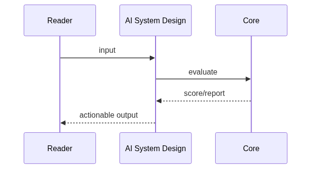

# Chapter 91: AI System Design

## Chapter Overview

Part X **Career** — **AI System Design**.

Practice AI system design with capacity estimates, latency budgets, and a production checklist.

Package: `code/chapter-091/sysdesign/`

## Learning Objectives

- Estimate QPS, storage, and peak load for AI products
- Allocate end-to-end latency budgets across retrieve / LLM / tools
- Walk a 10-point system design interview checklist
- Produce a structured design brief for an agent system

## Prerequisites

Parts I–IX (platform, systems, framework, real projects).

## Motivation

Career outcomes require deliberate practice: system design fluency, interview readiness,
a public portfolio, and a personal roadmap. This chapter gives concrete tools—not slogans.

## Architecture

```text
code/chapter-091/
  sysdesign/
  tests/
  main.py
  pyproject.toml
  README.md
```

## Internal Implementation

```bash
cd code/chapter-091 && pytest -q && python3 main.py
```

## Production Implementation

Use these modules as checklists in real interviews, design docs, GitHub READMEs, and quarterly planning.
Replace heuristic scorers with mentor feedback and production metrics over time.

## Mini Project

Run the chapter package end-to-end and adapt templates to your own target role or product.

## Visual diagrams




## Chapter Deliverables

| Artifact | Location |
|---|---|
| Manuscript | `book/chapter-091.md` |
| Package | `code/chapter-091/sysdesign/` |
| Tests | `code/chapter-091/tests/` |

## Chapter Summary

AI System Design kit turns vague interview prompts into quantified architecture briefs.

## What's Next

**Chapter 92** covers technical interview practice loops and rubrics.
