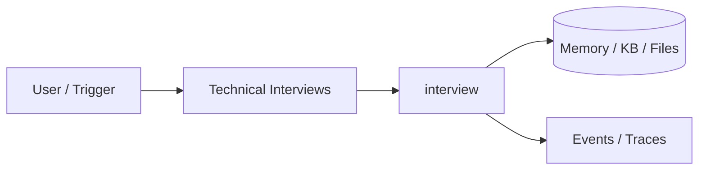

# Chapter 92: Technical Interviews

## Chapter Overview

Part X — Career — **Technical Interviews** — package `interview`.

`InterviewBank` DEFAULT_BANK, `score_answer` keyword+structure rubric, `MockInterview.ask/summary`.

Part X closes the book with **career engineering**. Chapter 92 uses `interview/` as a practical toolkit — not a toy agent, but rubrics and planners you reuse while interviewing and shipping OSS.

**Code:** `code/chapter-092/interview/`. Focus on offline core; containerize when integrating Part VII Docker patterns (Ch 58).

---

## Learning Objectives

After completing this chapter, you can:

- Use `interview` for repeatable career and interview workflows
- Connect toolkit output to Part IX portfolio evidence
- Produce artifacts you can reuse in mocks and design reviews
- Run pytest and CLI offline without live API keys
- Identify gaps honestly (rubrics surface missing keywords or README flags)
- Apply exercises to your target role, startup idea, or pinned repos this week

---

## Prerequisites

- Completed or skimming Parts I–IX (especially Part IX projects for portfolio evidence)
- Prior Part X chapters when `n > 91` (through Chapter 91)

---

## Motivation

Agent interview loops blend **system design**, **coding**, and **behavioral** evidence. The `interview` package gives a **repeatable practice loop**: timed answer → `score_answer` → keyword/structure feedback → iterate until `passed`.

---

## First Principles

### 1. Questions tagged category/difficulty

Drill system_design, agents, coding, behavioral deliberately.

### 2. Keywords define coverage

Rubric keywords are minimum concept set; tune `min_keywords` for senior loops.

### 3. Structure required

Bullets or trade-off/summary markers—rambling fails the rubric.

### 4. Feedback lists missing concepts

`_feedback` names gaps before live mocks.

---

## Mental Model

Interview bank = sparring partner — questions, keyword rubric, structured feedback.



---

## Core Theory

### score_answer pipeline

1. Lowercase answer; count keyword hits.
2. `keyword_score = hits / len(keywords)`.
3. Check structure and length (≥ 40 chars).
4. `passed` when hits ≥ `min_keywords`, structure ok, length ok.

### DEFAULT_BANK highlights

| id | Category | Practice focus |
|---|---|---|
| `sd1` | system_design | Multi-tenant RAG support — retrieval, tenancy, eval, latency, cost |
| `ag1` | agents | Unsafe tools — allowlist, HITL, sandbox, policy, audit |
| `co1` | coding | Retry with backoff — idempotency, jitter, timeout |
| `be1` | behavioral | STAR incident — impact, root cause, fix, prevention |

### Example outline for `sd1`

1. Requirements — tenants, PII, SLO, budget cap.
2. Architecture — API → orchestrator → retrieve → generate → tools → eval gate.
3. Data — KB per tenant; audit tool calls.
4. Failure modes — retrieval miss → escalate; injection → block admin tools.
5. Metrics — eval pass_rate, p95 latency, cost per ticket.
6. Trade-offs — single agent vs router; sync vs queued workers.
### Failure cases

Buzzwords without metrics; over-long answers; missing trade-offs—rubric fails closed.

### Performance implications

Time-box practice (8–12 min SD, 25–35 min coding); batch score three answers then rewrite one.

### Security implications

Never paste employer-confidential designs into practice tools or public repos.
### How this chapter fits Part X

Use output from this toolkit together with Part IX repos: Ch 91 briefs for design depth, Ch 92 rubric for mock loops, Ch 93 scorer for GitHub polish, Ch 94 roadmap for what to ship next quarter. Re-run exercises after you upgrade a Part IX project so artifacts stay honest.

---

## Architecture

```text
code/chapter-092/
  interview/
  tests/
  main.py
  pyproject.toml
  README.md
```

---

## Internal Implementation

```bash
cd code/chapter-092 && pytest -q && python3 main.py
```

Practice sd1 and ag1; improve until passed.

---

## Production Implementation

Pair with mock interviews; log pass_rate over time.

---

## Framework Implementation

Pramp, interviewing.io — use this bank for self-study.

---

## Trade-offs

| Option A | Option B / notes |
|---|---|
| Keyword rubric | Objective self-grade. |
| LLM judge | Richer feedback; costly. |

---

## Debugging

- False fail structure → add numbered list
- Short answer → expand example

---

## Performance

N/A — human practice loop.

---

## Security

Do not leak employer confidential designs in practice answers.

---

## Best Practices

1. Run `pytest -q` before every demo
2. Emit structured events/traces for debugging
3. Document architecture and failure modes in README
4. Connect project to Part VII API/workers when deploying
5. Add eval cases (Ch 44 mindset) for agent behaviors
6. Keep secrets out of repos and Docker layers

---

## Anti-Patterns

- **Demo without tests** — Regressions invisible
- **Live keys in CI** — Credential leaks
- **Unbounded agent loops** — Cost and safety incidents
- **Skipping escalation/HITL on risky tools** — Trust and compliance failures
- **Portfolio README empty** — Hiring signal lost
- **Learning without milestones** — Skill gaps never close

---

## Hands-on Exercise

1. `cd code/chapter-092 && pytest -q`
2. Answer `sd1` in writing (~300 words) with numbered sections; run through `MockInterview.ask`
3. Repeat for `ag1`; compare keyword hits in `summary()`
4. Add one custom `Question` for your target company's stack
5. Pair with a peer: they pick `be1`, you score their answer with the same rubric

---

## Mini Project

**Question bank with rubric scoring.** Apply the kit to your own target role or startup idea this week.

---

## Visual diagrams


---

## Chapter Deliverables

| Artifact | Location |
|---|---|
| Manuscript | `book/chapter-092.md` |
| Package | `code/chapter-092/interview/` |
| Tests | `code/chapter-092/tests/` |

---

## Interview Questions

1. How to answer agent safety question?
2. System design opening script?
3. Behavioral STAR?

---

## Quiz

1. Rubric checks structure via:
   A) bullets/sections B) GPU C) DNS D) MAC
   **Answer:** A

2. DEFAULT_BANK includes:
   A) sd1/ag1 B) only GPU C) DNS D) none
   **Answer:** A

3. MockInterview.summary has:
   A) pass_rate B) GPU temp C) DNS D) TLS
   **Answer:** A

---

## Cheat Sheet

- `InterviewBank.get`
- `MockInterview.ask`
- score_answer

---

## Curated Free Resources

- [Behavioral STAR method](https://www.themuse.com/advice/star-interview-method)

---

## Chapter Summary

**Technical Interviews** — offline question bank with keyword and structure rubric. Use timed reps until `passed`, then graduate to live mocks with Ch 91 design briefs as reference.

---

## What's Next

**Chapter 93: Portfolio & Open Source.** Chapter 93 scores portfolio projects and OSS.
