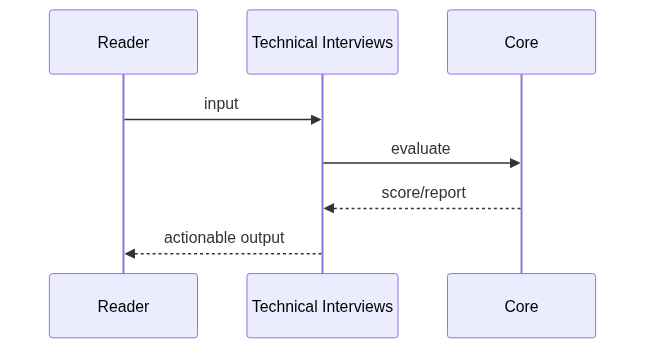
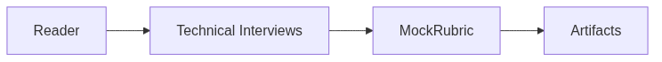

# Chapter 92: Technical Interviews

## Chapter Overview

Part X **Career** — **Technical Interviews**.

Run mock technical interviews with a question bank, keyword rubrics, and pass/fail feedback.

Package: `code/chapter-092/interview/`

## Learning Objectives

- Practice system design, agents, coding, and behavioral prompts
- Score answers with keyword + structure rubrics
- Track mock session pass rates
- Turn feedback into study loops

## Prerequisites

Parts I–IX (platform, systems, framework, real projects).

## Motivation

Career outcomes require deliberate practice: system design fluency, interview readiness,
a public portfolio, and a personal roadmap. This chapter gives concrete tools—not slogans.

## Architecture

```text
code/chapter-092/
  interview/
  tests/
  main.py
  pyproject.toml
  README.md
```

## Internal Implementation

```bash
cd code/chapter-092 && pytest -q && python3 main.py
```

## Production Implementation

Use these modules as checklists in real interviews, design docs, GitHub READMEs, and quarterly planning.
Replace heuristic scorers with mentor feedback and production metrics over time.

## Mini Project

Run the chapter package end-to-end and adapt templates to your own target role or product.

## Visual diagrams





## Chapter Deliverables

| Artifact | Location |
|---|---|
| Manuscript | `book/chapter-092.md` |
| Package | `code/chapter-092/interview/` |
| Tests | `code/chapter-092/tests/` |

## Chapter Summary

Technical Interviews package provides a repeatable offline mock-interview loop.

## What's Next

**Chapter 93** builds portfolio and open-source contribution trackers.
