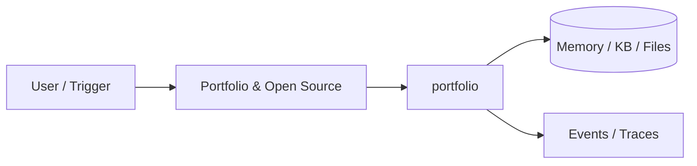

# Chapter 93: Portfolio & Open Source

## Chapter Overview

Part X — Career — **Portfolio & Open Source** — package `portfolio`.

`score_project` grades README flags, tests, CI, docker, production_used, stars; `Portfolio.report` recommendations.

Part X closes the book with **career engineering**. Chapter 93 uses `portfolio/` as a practical toolkit — not a toy agent, but rubrics and planners you reuse while interviewing and shipping OSS.

**Code:** `code/chapter-093/portfolio/`. Focus on offline core; containerize when integrating Part VII Docker patterns (Ch 58).

---

## Learning Objectives

After completing this chapter, you can:

- Use `portfolio` for repeatable career and interview workflows
- Connect toolkit output to Part IX portfolio evidence
- Produce artifacts you can reuse in mocks and design reviews
- Run pytest and CLI offline without live API keys
- Identify gaps honestly (rubrics surface missing keywords or README flags)
- Apply exercises to your target role, startup idea, or pinned repos this week

---

## Prerequisites

- Completed or skimming Parts I–IX (especially Part IX projects for portfolio evidence)
- Prior Part X chapters when `n > 91` (through Chapter 92)

---

## Motivation

For **agent engineering** roles, a portfolio proves you ship loops, evals, and ops—not slide decks. Part IX (Ch 81–90) is raw material; this chapter scores how presentable repos are on GitHub.

---

## First Principles

### 1. README checklist

`README_CHECKS` maps to what recruiters scan in 60 seconds.

### 2. Heuristic 0–100 score

Transparent gaps list drives polish order.

### 3. Track OSS contributions

Merged PRs signal collaboration.

### 4. Recommendations auto-generated

`Portfolio.report()` → `_recs()` for actionable next steps.

---

## Mental Model

Portfolio = proof-of-work resume — README sections, tests, CI, merged PRs.



---

## Core Theory

### score_project mechanics

README flags ~8 pts each; tests 12, CI 10, Docker 8, production_used 10; stars capped at 10. Returns `details` and `gaps` per project.

### Mapping Part IX → portfolio

| Chapter project | Portfolio story |
|---|---|
| 81 Chatbot | Multi-turn product + session API |
| 82 PDF Chat | Grounded RAG + citations |
| 88 Support | KB + escalation |
| 90 Multi-agent | Orchestration + message bus |

Pin **two** A-grade repos on GitHub; treat others as labs until scored up.

### Portfolio.report()

Aggregates `avg_score`, merged contributions, and **recommendations**—run before updating resume or LinkedIn featured section.
### Failure cases

Empty portfolio; all C/D grades; zero merged OSS—the scorer surfaces gaps, not code quality review.

### Performance implications

CI on a `portfolio.yaml` manifest if you maintain many repos.

### Security implications

Public repos: secret scanners; no `.env` or customer data in fixtures.
### How this chapter fits Part X

Use output from this toolkit together with Part IX repos: Ch 91 briefs for design depth, Ch 92 rubric for mock loops, Ch 93 scorer for GitHub polish, Ch 94 roadmap for what to ship next quarter. Re-run exercises after you upgrade a Part IX project so artifacts stay honest.

---

## Architecture

```text
code/chapter-093/
  portfolio/
  tests/
  main.py
  pyproject.toml
  README.md
```

---

## Internal Implementation

```bash
cd code/chapter-093 && pytest -q && python3 main.py
```

Score a Part IX project metadata; fix gaps.

---

## Production Implementation

Publish Part IX repos public; link in resume; keep CI green.

---

## Framework Implementation

GitHub profile pinned repos; README templates.

---

## Trade-offs

| Option A | Option B / notes |
|---|---|
| Heuristic portfolio score | Fast gap analysis. |
| Human recruiter review | Gold standard. |

---

## Debugging

- Low grade → readme_flags false
- Empty portfolio → recs suggest 2-3 projects

---

## Performance

N/A

---

## Security

No secrets in public repos; scan with gitleaks.

---

## Best Practices

1. Run `pytest -q` before every demo
2. Emit structured events/traces for debugging
3. Document architecture and failure modes in README
4. Connect project to Part VII API/workers when deploying
5. Add eval cases (Ch 44 mindset) for agent behaviors
6. Keep secrets out of repos and Docker layers

---

## Anti-Patterns

- **Demo without tests** — Regressions invisible
- **Live keys in CI** — Credential leaks
- **Unbounded agent loops** — Cost and safety incidents
- **Skipping escalation/HITL on risky tools** — Trust and compliance failures
- **Portfolio README empty** — Hiring signal lost
- **Learning without milestones** — Skill gaps never close

---

## Hands-on Exercise

1. `cd code/chapter-093 && pytest -q`
2. Model a `Project` for `code/chapter-088`: set readme flags from its README truthfully
3. Run `score_project`; fix the top gap on the real repo (e.g. architecture diagram)
4. Add a merged `Contribution` entry for a docs or test PR you plan to land
5. Re-run `Portfolio.report()` and paste `recommendations` into your personal backlog

---

## Mini Project

**Portfolio scorer and OSS contribution tracker.** Apply the kit to your own target role or startup idea this week.

---

## Visual diagrams


---

## Chapter Deliverables

| Artifact | Location |
|---|---|
| Manuscript | `book/chapter-093.md` |
| Package | `code/chapter-093/portfolio/` |
| Tests | `code/chapter-093/tests/` |

---

## Interview Questions

1. What makes a strong agent portfolio repo?
2. OSS contribution story?
3. Demo vs prose?

---

## Quiz

1. score_project returns:
   A) grade and gaps B) GPU C) DNS D) none
   **Answer:** A

2. README_CHECKS include:
   A) quickstart B) GPU serial C) DNS D) MAC
   **Answer:** A

3. merged PRs tracked in:
   A) Portfolio B) GPU C) DNS D) TLS
   **Answer:** A

---

## Cheat Sheet

- `score_project(Project)`
- `Portfolio.report()`
- README_CHECKS

---

## Curated Free Resources

- [Awesome README](https://github.com/matiassingers/awesome-readme)
- [Choose a License](https://choosealicense.com/)

---

## Chapter Summary

**Portfolio & Open Source** — heuristic scorer and OSS tracker. Use it to turn Part IX labs into two pinned, interview-ready repos with CI and README discipline.

---

## What's Next

**Chapter 94: Career Roadmap & Startup Guide.** Chapter 94 quarterly roadmap and startup canvas.
