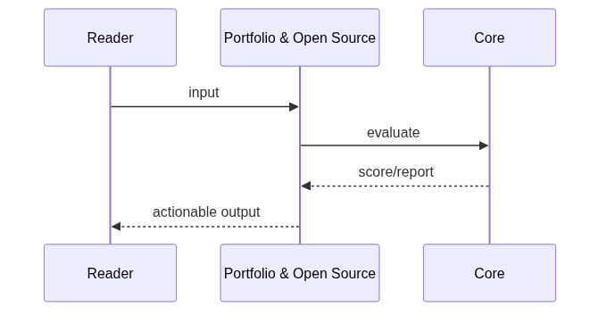
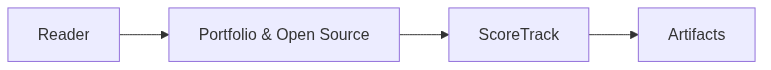

# Chapter 93: Portfolio & Open Source

## Chapter Overview

Part X **Career** — **Portfolio & Open Source**.

Score GitHub portfolio projects against hiring-friendly checklists and track OSS contributions.

Package: `code/chapter-093/portfolio/`

## Learning Objectives

- Apply a README / tests / CI / Docker quality rubric
- Grade projects A–D with actionable gaps
- Log open-source contributions and merged PRs
- Generate portfolio improvement recommendations

## Prerequisites

Parts I–IX (platform, systems, framework, real projects).

## Motivation

Career outcomes require deliberate practice: system design fluency, interview readiness,
a public portfolio, and a personal roadmap. This chapter gives concrete tools—not slogans.

## Architecture

```text
code/chapter-093/
  portfolio/
  tests/
  main.py
  pyproject.toml
  README.md
```

## Internal Implementation

```bash
cd code/chapter-093 && pytest -q && python3 main.py
```

## Production Implementation

Use these modules as checklists in real interviews, design docs, GitHub READMEs, and quarterly planning.
Replace heuristic scorers with mentor feedback and production metrics over time.

## Mini Project

Run the chapter package end-to-end and adapt templates to your own target role or product.

## Visual diagrams





## Chapter Deliverables

| Artifact | Location |
|---|---|
| Manuscript | `book/chapter-093.md` |
| Package | `code/chapter-093/portfolio/` |
| Tests | `code/chapter-093/tests/` |

## Chapter Summary

Portfolio & Open Source tooling turns vague 'build in public' advice into measurable scores.

## What's Next

**Chapter 94** closes the book with a career roadmap and startup guide.
