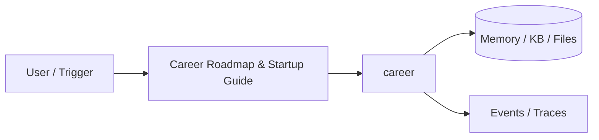
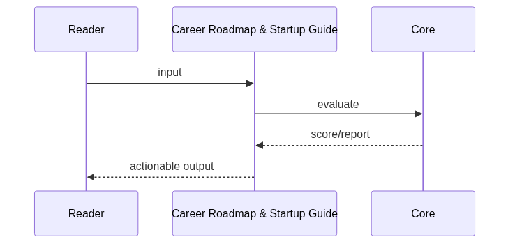
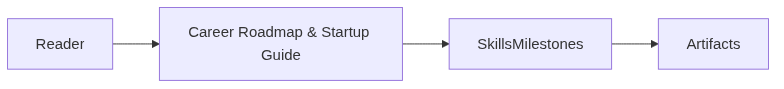

# Chapter 94: Career Roadmap & Startup Guide

## Chapter Overview

Part X — Career — **Career Roadmap & Startup Guide** — package `career`.

`StartupGuide.default_track` with SkillGraph, Roadmap milestones, LeanCanvas completeness, `snapshot()` next_actions.

Part X closes the book with **career engineering**. Chapter 94 uses `career/` as a practical toolkit — not a toy agent, but rubrics and planners you reuse while interviewing and shipping OSS.

**Code:** `code/chapter-094/career/`. Focus on offline core; containerize when integrating Part VII Docker patterns (Ch 58).

---

## Learning Objectives

After completing this chapter, you can:

- Use `career` for repeatable career and interview workflows
- Connect toolkit output to Part IX portfolio evidence
- Produce artifacts you can reuse in mocks and design reviews
- Run pytest and CLI offline without live API keys
- Identify gaps honestly (rubrics surface missing keywords or README flags)
- Apply exercises to your target role, startup idea, or pinned repos this week

---

## Prerequisites

- Completed or skimming Parts I–IX (especially Part IX projects for portfolio evidence)
- Prior Part X chapters when `n > 91` (through Chapter 93)

---

## Motivation

Closing the book is when **you** own the plan: skills to deepen from Parts I–IX, which Part IX repo to ship publicly, and whether you optimize for **employment**, **OSS**, or a **startup wedge**.

---

## First Principles

### 1. Skills have level vs target

gap = max(0, target - level) sorts learning queue.

### 2. Milestones by quarter

career|learning|startup|oss kinds on a calendar.

### 3. Lean canvas completeness

Nine fields; missing list blocks half-formed pitches.

### 4. next_actions merges gaps + milestone + canvas

Review weekly from `snapshot()`.

---

## Mental Model

Career roadmap = GPS + fuel gauge — skill gaps, quarterly milestones, lean canvas completeness.



---

## Core Theory

### SkillGraph.readiness_pct

readiness = 100 × sum(min(level,target)) / sum(target). `gaps()` sorted descending—study top gap before another Part IX project.

### Roadmap.progress

Groups milestones by quarter; default track includes portfolio CI, mock system designs, merged OSS PR, interview loop, ten-user validation.

### LeanCanvas and snapshot()

`default_track()` seeds DEFAULT_SKILLS (Python, orchestration, RAG, eval, production APIs, system design, OSS). Fill problem/customers before solution. `snapshot()` → readiness, roadmap pct, canvas completeness, **next_actions**.

### Quarterly review ritual (30 minutes)

1. Run `python3 main.py`; save JSON snapshot.
2. Mark one milestone complete if truly done.
3. Bump one skill level with evidence.
4. Fill one lean canvas field from customer conversations.
5. Execute **one** next action before adding goals.
### Failure cases

Inflated skill levels; milestones without dates; solution before problem—toolkit exposes gaps, discipline is yours.

### Performance implications

Small weekly updates beat annual overhauls; optional git snapshots for trend lines.

### Security implications

Keep private strategy out of public repos; share redacted canvas with mentors only.
### How this chapter fits Part X

Use output from this toolkit together with Part IX repos: Ch 91 briefs for design depth, Ch 92 rubric for mock loops, Ch 93 scorer for GitHub polish, Ch 94 roadmap for what to ship next quarter. Re-run exercises after you upgrade a Part IX project so artifacts stay honest.

---

## Architecture

```text
code/chapter-094/
  career/
  tests/
  main.py
  pyproject.toml
  README.md
```

---

## Internal Implementation

```bash
cd code/chapter-094 && pytest -q && python3 main.py
```

Complete one milestone; observe roadmap pct rise.

---

## Production Implementation

Revisit snapshot each quarter; align with book completion and Part IX shipping.

---

## Framework Implementation

OKRs, lean startup — map milestones to measurable outcomes.

---

## Trade-offs

| Option A | Option B / notes |
|---|---|
| Self-reported skill levels | Requires honest calibration. |
| Formal assessments | Slower; more objective. |

---

## Debugging

- 0 readiness → no skills added
- Canvas missing fields listed

---

## Performance

N/A

---

## Security

N/A

---

## Best Practices

1. Run `pytest -q` before every demo
2. Emit structured events/traces for debugging
3. Document architecture and failure modes in README
4. Connect project to Part VII API/workers when deploying
5. Add eval cases (Ch 44 mindset) for agent behaviors
6. Keep secrets out of repos and Docker layers

---

## Anti-Patterns

- **Demo without tests** — Regressions invisible
- **Live keys in CI** — Credential leaks
- **Unbounded agent loops** — Cost and safety incidents
- **Skipping escalation/HITL on risky tools** — Trust and compliance failures
- **Portfolio README empty** — Hiring signal lost
- **Learning without milestones** — Skill gaps never close

---

## Hands-on Exercise

1. `cd code/chapter-094 && pytest -q`
2. Clone `StartupGuide.default_track()`; adjust two skill targets for your role
3. Add a milestone for the next quarter with measurable definition of done
4. Complete `LeanCanvas.problem` and `customer_segments` with real notes
5. Call `snapshot()`; execute the first item in `next_actions` this week

---

## Mini Project

**Skill graph, roadmap, lean canvas snapshot.** Apply the kit to your own target role or startup idea this week.

---

## Visual diagrams





---

## Chapter Deliverables

| Artifact | Location |
|---|---|
| Manuscript | `book/chapter-094.md` |
| Package | `code/chapter-094/career/` |
| Tests | `code/chapter-094/tests/` |

---

## Interview Questions

1. How to prioritize skill gaps?
2. Startup vs employment track?
3. Quarterly review habit?

---

## Quiz

1. Skill.gap is:
   A) target-level B) GPU C) DNS D) random
   **Answer:** A

2. Roadmap groups by:
   A) quarter B) GPU C) DNS D) MAC
   **Answer:** A

3. snapshot includes:
   A) next_actions B) cookies only C) GPU D) none
   **Answer:** A

---

## Cheat Sheet

- `StartupGuide.default_track()`
- `snapshot()`
- LeanCanvas.completeness

---

## Curated Free Resources

- [Lean canvas](https://leanstack.com/lean-canvas)
- [AI career paths](https://www.deeplearning.ai/)

---

## Chapter Summary

**Career Roadmap & Startup Guide** — skill graph, quarterly roadmap, and lean canvas in one `snapshot()`. Revisit each quarter after Ch 91–93 interview and portfolio work.

---

## What's Next

**Chapter 95: Comprehensive Interview Question Bank.** Study **784** beginner-friendly Q&A pairs (**100+ per topic**: Python, ML, system design, AI engineering, generative AI, agentic AI, behavioral)—searchable offline via `code/chapter-095/`.
