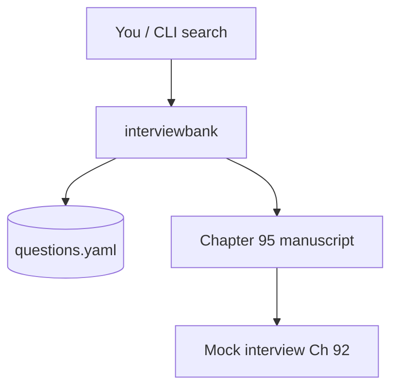

# Chapter 95: Comprehensive Interview Question Bank

## Chapter Overview

Part X — Career — **Comprehensive Interview Question Bank** — package `interviewbank`.

This chapter collects **1279** interview questions (**at least 100 per topic area**) with beginner-friendly answers, ordered from **Python** and **machine learning** through **system design**, **AI engineering**, **generative AI**, **prompt engineering**, **context engineering**, **loop engineering**, **agent frameworks** (LangGraph, LangChain, CrewAI, n8n, and related stacks), and **agentic AI**, plus **behavioral** prompts. Use it alongside Ch 92’s rubric practice and Ch 91’s design briefs.

**Code:** `code/chapter-095/interviewbank/` — load, filter, and search the same Q&A offline.

---

## Learning Objectives

After completing this chapter, you can:

- Navigate 1279+ questions across eleven topic areas without starting from a blank page
- Explain core concepts in plain language suitable for junior and career-switcher interviews
- Use `load_bank`, `get_by_category`, `get_by_difficulty`, and `search` to build custom flashcard sets
- Drill **intermediate** agent-framework prompts (LangGraph system design) for senior loops
- Connect answers to hands-on projects in Parts I–IX of this book
- Extend the YAML bank with your own `id`, category, question, and answer rows
- Practice spaced repetition: read → cover answer → explain aloud → check

---

## Prerequisites

- Chapters 1–7 (Python and engineering basics) for Python section context
- Parts II–III exposure helpful for ML and LLM sections
- Chapters 91–92 for system design and mock-interview workflow
- No live API keys required

---

## Motivation

Interview prep fragments easily: LeetCode here, a blog post there, LLM hype elsewhere. Hiring loops for **AI engineer**, **ML engineer**, and **agent builder** roles still expect fundamentals—Python, data, systems, models, RAG, tools, safety—explained clearly. This bank gives one **canonical, offline, beginner-first** reference you can grep, extend, and pair with the Ch 92 scoring loop.

---

## First Principles

### 1. Fundamentals before frameworks

Interviewers often probe Python, HTTP, and ML basics before LangChain trivia. Master definitions and trade-offs in this chapter first.

### 2. Short answers, deep follow-ups

Each answer here fits a 30–90 second response. Expect follow-ups (“give an example”, “what breaks at scale?”)—use Part IX projects as stories.

### 3. Same data in book and code

The manuscript and `questions.yaml` stay in sync via `scripts/_gen_ch95_interview_bank.py`—canonical data lives in **`scripts/data/interview_bank.yaml`** (100+ questions per category).

### 4. Beginner-friendly ≠ oversimplified

We avoid jargon walls but name real concepts (RAG, idempotency, GIL) so you can search and learn further.

---

## Mental Model

Flash library with shelf labels — Python shelf, ML shelf, System Design shelf, Gen AI shelf, Agent shelf — each card has question (front) and answer (back).



---

## Core Theory

This chapter is a **read-through reference** and matches the machine-readable bank in `code/chapter-095/interviewbank/questions.yaml`. Beginner answers are short; **intermediate** items (especially under agent frameworks) expect system-design depth—practice with whiteboard and follow-up probes.

**Total questions:** 1279

### Python (136 questions)

#### Beginner track (136)

##### Q1. What is list?

An ordered, mutable collection written with square brackets; use it for sequences that change.

##### Q2. What is tuple?

An ordered, immutable collection; good for fixed records and dict keys.

##### Q3. What is dict?

A mapping from hashable keys to values; fast lookup by key.

##### Q4. What is set?

Unordered collection of unique items; useful for membership and deduplication.

##### Q5. What is frozenset?

Immutable set; can be used as a dict key or set element.

##### Q6. What is list.append?

Adds one element to the end of a list in amortized O(1) time.

##### Q7. What is list.extend?

Adds all elements from another iterable—prefer extend over repeated append for performance.

##### Q8. What is list comprehension?

Compact syntax to build lists: [f(x) for x in items if cond(x)].

##### Q9. What is dict comprehension?

Builds dicts: {k: v for k, v in pairs}—keep expressions readable.

##### Q10. What is set comprehension?

Builds sets with unique elements from an iterable comprehension.

##### Q11. What is slice operator?

Extracts sub-sequences: s[start:stop:step]; stop is exclusive.

##### Q12. What is negative indexing?

s[-1] is the last item; useful but keep readability in mind.

##### Q13. What is string formatting with f-strings?

f"hello {name}" embeds expressions—preferred over % or .format for clarity.

##### Q14. What is strip method?

Removes leading/trailing whitespace from strings—common when parsing user input.

##### Q15. What is split and join?

split breaks strings into lists; join merges strings with a separator.

##### Q16. What is regular expressions?

Pattern matching for text; compile patterns once for reuse in log parsing.

##### Q17. What is os module?

Operating system interfaces—paths, env vars; prefer pathlib for paths in new code.

##### Q18. What is pathlib.Path?

Object-oriented paths: join with /, read_text, exists—cleaner than os.path strings.

##### Q19. What is pickle?

Serializes Python objects to bytes—never unpickle untrusted data (security risk).

##### Q20. What is json module?

Standard JSON encode/decode for APIs and agent tool payloads.

##### Q21. What is csv module?

Reads/writes tabular text files—good for simple data import without pandas.

##### Q22. What is datetime module?

Represents dates/times; use timezone-aware objects in production logs.

##### Q23. What is collections.defaultdict?

Dict that auto-creates missing keys—handy for grouping counts.

##### Q24. What is collections.Counter?

Counts hashable items—quick frequency summaries.

##### Q25. What is collections.deque?

Double-ended queue with fast append/pop on both ends—useful for BFS buffers.

##### Q26. What is itertools?

Iterator utilities (chain, islice, product)—memory-efficient loops.

##### Q27. What is functools.lru_cache?

Memoizes function results—speeds pure functions with repeated args.

##### Q28. What is functools.partial?

Fixes some arguments of a callable—creates specialized callbacks.

##### Q29. What is operator module?

Function versions of operators—occasionally used in functional-style code.

##### Q30. What is typing.Optional?

Means value or None—documents nullable parameters for readers and tools.

##### Q31. What is typing.Union?

One of several types; in 3.10+ prefer X

##### Q32. What is typing.Protocol?

Structural typing—duck typing with type checker support.

##### Q33. What is Abstract Base Classes?

Define interfaces subclasses must implement—useful for plugin seams.

##### Q34. What is property decorator?

Exposes method as attribute with optional getter/setter logic.

##### Q35. What is staticmethod?

Method on class without self/cls—namespace convenience.

##### Q36. What is classmethod?

Receives cls—common for alternate constructors.

##### Q37. What is magic method __repr__?

Developer-friendly string for debugging; aim for unambiguous output.

##### Q38. What is magic method __str__?

User-facing string; can defer to __repr__ if similar.

##### Q39. What is magic method __len__?

Enables len(obj)—implement for custom collections.

##### Q40. What is magic method __enter__/__exit__?

Enables with-statement context management.

##### Q41. What is an iterator protocol?

Objects with __iter__ and __next__; StopIteration ends iteration.

##### Q42. What is a generator function?

Uses yield to produce lazy sequences—memory friendly.

##### Q43. What is yield from?

Delegates to sub-generator—flattens nested iteration cleanly.

##### Q44. What is coroutine?

Async function consumed by await—foundation of asyncio.

##### Q45. What is await keyword?

Pauses coroutine until awaited task completes—does not block the event loop.

##### Q46. What is asyncio.create_task?

Schedules coroutine concurrently—remember to await or gather.

##### Q47. What is asyncio.gather?

Runs multiple awaitables concurrently and collects results.

##### Q48. What is a threading.Lock?

Mutex for shared mutable state between threads—keep critical sections tiny.

##### Q49. What is multiprocessing?

Separate processes bypass GIL for CPU-bound parallelism—higher startup cost.

##### Q50. What is concurrent.futures?

High-level thread/process pools—map/submit patterns for parallel I/O or CPU work.

##### Q51. What is subprocess module?

Spawn shell commands—validate args; avoid shell=True with user input.

##### Q52. What is argparse?

CLI argument parsing—standard for chapter main.py scripts.

##### Q53. What is logging levels?

DEBUG/INFO/WARNING/ERROR/CRITICAL filter verbosity—use INFO in prod defaults.

##### Q54. What is structlog or extra dict logging?

Structured fields help log aggregators correlate agent traces.

##### Q55. What is unittest vs pytest?

unittest is stdlib; pytest simpler asserts and fixtures—this book uses pytest.

##### Q56. What is pytest fixture?

Reusable setup injected by name—share clients, temp dirs, mock LLMs.

##### Q57. What is pytest parametrize?

Runs same test with multiple inputs—table-driven tests.

##### Q58. What is mock from unittest.mock?

Patch dependencies—essential for offline agent tests.

##### Q59. What is MagicMock?

Auto-creates attributes on access—use spec=RealClass to catch typos.

##### Q60. What is tempfile module?

Secure temporary files/dirs for tests without collisions.

##### Q61. What is venv module?

Creates virtual environments—python -m venv .venv.

##### Q62. What is pip freeze?

Lists installed packages—pin versions for reproducible environments.

##### Q63. What is requirements.txt vs pyproject?

requirements pins env; pyproject declares project metadata—prefer pyproject for libraries.

##### Q64. What is __slots__?

Restricts instance attributes—saves memory for many small objects.

##### Q65. What is dataclass field?

Correct pattern for mutable defaults in dataclasses.

##### Q66. What is Enum?

Named constants—clearer than raw strings for statuses and categories.

##### Q67. What is NamedTuple?

Immutable lightweight records—alternative to dataclass when tuple-like.

##### Q68. What is TypedDict?

Dict with typed keys—common for JSON-shaped message dicts.

##### Q69. What is Protocol for LLM client?

Define complete(messages)->str interface; swap mock and real implementations.

##### Q70. What is Recursion?

Function calls itself—always define base case; watch stack depth.

##### Q71. What is Big-O intuition for list append?

Amortized O(1) append; O(n) insert at front due to shifting.

##### Q72. What is hashability?

Immutable objects often hashable—dict keys must be hashable.

##### Q73. What is shallow vs deep copy?

copy.copy vs copy.deepcopy—choose deep when nested mutability matters.

##### Q74. What is assert statement?

Development checks—disable with -O; use pytest asserts in tests instead in libraries.

##### Q75. What is if __name__ == '__main__'?

Guard script entrypoint so imports stay side-effect free.

##### Q76. What is package __init__.py?

Marks package; can re-export public API.

##### Q77. What is relative imports?

from .module import x—use within package hierarchy.

##### Q78. What is NameError vs AttributeError?

NameError: variable missing; AttributeError: object lacks attribute.

##### Q79. What is KeyError vs IndexError?

KeyError: missing dict key; IndexError: sequence out of range.

##### Q80. What is ValueError vs TypeError?

ValueError: right type wrong value; TypeError: wrong type altogether.

##### Q81. What is EAFP vs LBYL?

Python prefers try/except (EAFP) over look-before-you-leap for race-prone checks.

##### Q82. What is contextlib.suppress?

Context manager to ignore specific exceptions cleanly.

##### Q83. What is contextlib.contextmanager?

Build context managers from generator functions with yield.

##### Q84. What is walrus operator :=?

Assigns in expression—use sparingly for readability.

##### Q85. What is match/case?

Structural pattern matching—alternative to long if/elif chains.

##### Q86. What is typing.Generic?

Generic classes List[T], Dict[K,V]—document container element types.

##### Q87. What is bytes vs str?

bytes for raw binary; str for text—encode/decode explicitly at boundaries.

##### Q88. What is unicode normalization?

Different Unicode forms can look identical—normalize when comparing user strings.

##### Q89. What is time.sleep vs asyncio.sleep?

time.sleep blocks thread; asyncio.sleep yields to event loop.

##### Q90. What is queue.Queue?

Thread-safe FIFO—producer/consumer between threads.

##### Q91. What is asyncio.Queue?

Async queue for coroutines—common in agent worker pools.

##### Q92. What is heapq module?

Min-heap for priority queues—scheduling tasks by priority.

##### Q93. What is bisect module?

Binary search on sorted lists—insert while keeping order.

##### Q94. What is math vs numpy?

math for scalars; numpy for vectorized arrays—AI code uses numpy heavily.

##### Q95. What is sys.path manipulation?

Insert project root for scripts—pyproject/pythonpath preferred in tests.

##### Q96. What is importlib?

Dynamic imports—plugin loaders use importlib.import_module.

##### Q97. What is zipfile module?

Read/write zip archives—packaging datasets or bundles.

##### Q98. What is tarfile module?

Archive utility—common in Linux deploy artifacts.

##### Q99. What is hashlib?

Cryptographic hashes SHA256—checksum files, not for passwords alone.

##### Q100. What is secrets module?

Secure random tokens—use for API keys in scripts, not random module.

##### Q101. What is hmac?

Message authentication with secret key—verify webhook signatures.

##### Q102. What is base64 encoding?

Text-safe encoding of bytes—not encryption.

##### Q103. What is urllib.parse?

Split/join URLs—validate redirects in web agents.

##### Q104. What is http.client vs requests?

stdlib low-level; requests third-party ergonomic—agents often use httpx/requests.

##### Q105. What is socket basics?

Endpoints for network—understand TCP connection before debugging APIs.

##### Q106. What is SSL/TLS context?

Encrypted HTTP—certificates required for HTTPS clients.

##### Q107. What is doctest?

Tests in docstrings—lightweight examples; pytest usually primary.

##### Q108. What is pdb debugger?

Interactive debugger—breakpoints via breakpoint() in 3.7+.

##### Q109. What is breakpoint?

Enters debugger at line—remove before production deploys.

##### Q110. What is memoryview?

Zero-copy slices of bytes buffers—advanced binary protocols.

##### Q111. What is weakref?

References that do not prevent garbage collection—caches without leaks.

##### Q112. What is gc module?

Garbage collector interface—debug circular references rarely needed.

##### Q113. What is sys.getsizeof?

Shallow size of object—profiling memory starts here.

##### Q114. What is cProfile?

Profiles CPU time per function—find hot loops before optimizing.

##### Q115. What is timeit module?

Micro-benchmark snippets—compare small code variants.

##### Q116. What is Sphinx or MkDocs?

Documentation generators—turn docstrings into sites for portfolio repos.

##### Q117. How do you reverse a list in place?

list.reverse() reverses in place; reversed(list) returns iterator without mutating.

##### Q118. Difference between copy and deepcopy?

copy shares nested objects; deepcopy duplicates entire tree.

##### Q119. How to merge two dicts?

In 3.9+ use d1

##### Q120. What does enumerate give you?

Index and value pairs—avoid manual counter variables.

##### Q121. Why use with open(...)?

Guarantees file close even on exceptions.

##### Q122. How to handle JSON from API?

response.json() if using requests; json.loads on text with try/except.

##### Q123. What is a lambda?

Anonymous one-expression function—use def when logic grows.

##### Q124. List vs generator for large files?

Generator reads line by line—constant memory.

##### Q125. How to sort a list of dicts?

sorted(items, key=lambda x: x['name'])—stable sort in Python.

##### Q126. What is None?

Singleton meaning no value—check with `is None`, not == None.

##### Q127. How do * and ** work in function calls?

* unpacks iterable args; ** unpacks keyword dict.

##### Q128. What is __init__?

Constructor hook—initialize instance state; call super() in subclasses.

##### Q129. How does inheritance work?

Subclass gets attributes/methods; override methods; super() calls parent.

##### Q130. What is MRO?

Method Resolution Order—C3 linearization determines lookup chain.

##### Q131. What is a namespace?

Mapping names to objects—modules, classes, functions each have namespaces.

##### Q132. How to install a package editable?

pip install -e . from directory with pyproject/setup—dev changes apply immediately.

##### Q133. What is PYTHONPATH?

Env var adding dirs to import search path—prefer venv and proper packaging.

##### Q134. How to read env vars?

os.environ.get('KEY', default)—load .env only in dev.

##### Q135. What is a bytes literal?

b'abc' denotes bytes—encode strings before sending on binary protocols.

##### Q136. How to time code quickly?

time.perf_counter() around block; for micro-bench use timeit.

### Machine Learning (110 questions)

#### Beginner track (110)

##### Q1. What is linear regression?

Predicts continuous target as weighted sum of features plus bias; minimize MSE.

##### Q2. What is logistic regression?

Linear model + sigmoid for classification; outputs probabilities.

##### Q3. What is decision tree?

Splits features by thresholds; interpretable but can overfit without pruning.

##### Q4. What is random forest?

Ensemble of trees on bootstrapped data—reduces variance.

##### Q5. What is gradient boosting?

Adds trees correcting prior errors—often strong on tabular data.

##### Q6. What is k-means clustering?

Partitions points into k clusters by minimizing within-cluster variance.

##### Q7. What is kNN classifier?

Classifies by majority vote of k nearest training points—simple baseline.

##### Q8. What is naive Bayes?

Assumes feature independence; fast text classification baseline.

##### Q9. What is SVM intuition?

Finds margin-maximizing boundary; kernels map to higher dimensions.

##### Q10. What is PCA?

Linear dimensionality reduction preserving variance—visualize and denoise features.

##### Q11. What is train/validation split?

Hold out validation for model selection; never tune on test set.

##### Q12. What is stratified split?

Preserves class ratios in splits—important for imbalance.

##### Q13. What is one-vs-rest multiclass?

Train one classifier per class vs all others.

##### Q14. What is softmax multiclass?

Outputs class probabilities summing to 1 in neural classifiers.

##### Q15. What is cross-entropy loss?

Classification loss comparing predicted distribution to true label.

##### Q16. What is MSE loss?

Average squared error—common for regression.

##### Q17. What is MAE loss?

Average absolute error—robust to outliers vs MSE.

##### Q18. What is L1 regularization?

Adds sum of absolute weights—encourages sparsity.

##### Q19. What is L2 regularization?

Adds sum of squared weights—weight decay in neural nets.

##### Q20. What is dropout?

Randomly zero activations during training—reduces co-adaptation overfitting.

##### Q21. What is batch normalization?

Normalizes layer inputs—stabilizes deep network training.

##### Q22. What is learning rate schedule?

Decays LR over time—fine-tune convergence.

##### Q23. What is Adam optimizer?

Adaptive learning rates per parameter—default choice for many deep models.

##### Q24. What is SGD with momentum?

Classic optimizer—momentum smooths noisy gradients.

##### Q25. What is epoch?

One full pass over training dataset.

##### Q26. What is mini-batch?

Subset per gradient step—balances noise and speed.

##### Q27. What is weight initialization?

Start weights smartly—bad init slows or breaks training.

##### Q28. What is vanishing gradients?

Gradients shrink in deep nets—ReLU/residual connections help.

##### Q29. What is exploding gradients?

Gradients grow huge—gradient clipping mitigates.

##### Q30. What is ReLU activation?

max(0,x)—simple, effective default nonlinearity.

##### Q31. What is sigmoid activation?

Squashes to (0,1)—used in gates and binary outputs.

##### Q32. What is tanh activation?

Zero-centered squash—sometimes better than sigmoid in hidden layers.

##### Q33. What is softmax activation?

Normalizes vector to probabilities—multi-class output layer.

##### Q34. What is attention (ML context)?

Weighted mix of inputs—precursor to transformers in seq models.

##### Q35. What is transformer (ML overview)?

Attention-based architecture dominating NLP and beyond.

##### Q36. What is CNN intuition?

Local filters detect patterns—dominant in vision before ViT.

##### Q37. What is RNN intuition?

Sequential hidden state—largely replaced by transformers for long seq.

##### Q38. What is LSTM?

Gated RNN reducing vanishing memory—historical seq modeling.

##### Q39. What is GRU?

Simpler gated RNN—fewer params than LSTM.

##### Q40. What is word2vec idea?

Predict context words—learns word embeddings.

##### Q41. What is TF-IDF?

Lexical weighting for text—baseline before dense embeddings.

##### Q42. What is bag of words?

Counts word frequencies—simple text features.

##### Q43. What is feature scaling (standardization)?

Zero mean unit variance—helps distance-based models.

##### Q44. What is min-max scaling?

Scales to fixed range—sensitive to outliers.

##### Q45. What is label encoding vs one-hot?

Label encoding ordinals risky; one-hot for nominal categories.

##### Q46. What is target leakage?

Feature encodes future info—fix by time-safe feature engineering.

##### Q47. What is imbalanced dataset handling?

Class weights, oversampling (SMOTE), or different metrics.

##### Q48. What is ROC curve?

TPR vs FPR across thresholds—visualize trade-offs.

##### Q49. What is AUC score?

Area under ROC—threshold-independent ranking metric.

##### Q50. What is precision@k?

Precision among top k predictions—common in recommender eval.

##### Q51. What is recall@k?

Fraction of relevant items found in top k.

##### Q52. What is confusion matrix interpretation?

See TP/FP/FN/TN—derive metrics per class.

##### Q53. What is macro vs micro F1?

Macro averages classes equally; micro aggregates counts globally.

##### Q54. What is calibration plot?

Predicted prob vs observed frequency—important for decision thresholds.

##### Q55. What is Brier score?

Measures prob accuracy—lower is better.

##### Q56. What is ML pipeline (sklearn)?

Chains preprocessing + model—prevents leakage in CV.

##### Q57. What is ColumnTransformer?

Applies different preprocessors per column type.

##### Q58. What is GridSearchCV?

Exhaustive hyperparam search with cross-validation.

##### Q59. What is RandomizedSearchCV?

Samples hyperparams—faster exploration.

##### Q60. What is early stopping on validation?

Stop when val metric worsens—save best checkpoint.

##### Q61. What is model serialization joblib?

Dump sklearn/pytorch sklearn models to disk.

##### Q62. What is ONNX export idea?

Run same model in multiple runtimes.

##### Q63. What is batch inference?

Score many rows together—throughput optimization.

##### Q64. What is real-time inference?

Low latency single request—agent chat path.

##### Q65. What is feature importance (tree)?

Split gain or impurity decrease—interpret tabular models.

##### Q66. What is SHAP intuition?

Assigns each feature contribution to prediction—explainability.

##### Q67. What is data drift?

Input distribution changes—monitor in production.

##### Q68. What is concept drift?

Relationship X→y changes—needs retrain or refresh.

##### Q69. What is active learning?

Label most informative points—reduce labeling cost.

##### Q70. What is weak supervision?

Noisy heuristics generate labels—scale labeling carefully.

##### Q71. What is semi-supervised learning?

Uses small labeled + large unlabeled data.

##### Q72. What is self-supervised learning?

Pretext tasks from unlabeled data—foundation models.

##### Q73. What is transfer learning?

Start from pretrained weights—fine-tune on downstream task.

##### Q74. What is domain adaptation?

Model trained on source domain applied to shifted target domain.

##### Q75. What is ensemble averaging?

Average predictions of multiple models—often improves stability.

##### Q76. What is stacking?

Meta-model learns from base model outputs.

##### Q77. What is bagging?

Bootstrap aggregating—decorrelate models like random forest.

##### Q78. What is boosting iteration?

Each model focuses on previous mistakes.

##### Q79. What is hyperparameter?

Config set before training—trees depth, learning rate, etc.

##### Q80. What is bias in datasets?

Skewed sampling causes unfair outcomes—audit and mitigate.

##### Q81. What is fairness metric?

Compare performance across groups—demographic parity, equalized odds debates.

##### Q82. What is differential privacy (intro)?

Adds noise to protect individuals in aggregate training—research area.

##### Q83. What is federated learning (intro)?

Train across devices without centralizing raw data.

##### Q84. What is GPU training?

Parallel matrix ops accelerate deep learning.

##### Q85. What is mixed precision training?

FP16/BF16 speeds training with loss scaling.

##### Q86. What is distributed training?

Data/model parallel across many GPUs—large model scale.

##### Q87. What is experiment tracking?

Log params, metrics, artifacts—MLflow, W&B, etc.

##### Q88. What is reproducibility seed?

Fix random seeds—still not full determinism on GPU.

##### Q89. What is train-serving skew?

Training features differ from live features—breaks prod accuracy.

##### Q90. What is point-in-time features?

Features only use past data—critical for temporal tabular ML.

##### Q91. What is cold start problem?

New users/items lack history—content features or defaults help.

##### Q92. What is recommendation matrix factorization?

Learns latent factors for users and items.

##### Q93. What is collaborative filtering?

Recommend from similar users' behavior.

##### Q94. What is content-based filtering?

Recommend from item attributes similarity.

##### Q95. What is  NLP tokenization?

Split text to tokens—model-specific tokenizers differ.

##### Q96. What is sequence padding?

Make batches equal length—pad and mask in transformers.

##### Q97. What is attention mask?

Tells model which tokens are real vs pad.

##### Q98. What is perplexity (LM metric)?

Lower is better language modeling—compare generative models.

##### Q99. What is BLEU score?

N-gram overlap for translation—imperfect but classic.

##### Q100. What is human eval for ML?

Gold standard for open-ended generation quality.

##### Q101. What is supervised vs unsupervised?

Supervised uses labels; unsupervised finds structure without labels.

##### Q102. Why hold out a test set?

Unbiased final estimate after all tuning decisions.

##### Q103. What breaks with high cardinality categoricals?

Huge one-hot space—use embeddings or target encoding carefully.

##### Q104. When is accuracy misleading?

Imbalanced classes—majority classifier looks good.

##### Q105. What is the curse of dimensionality?

Distance metrics degrade in very high dimensions—needs more data or reduction.

##### Q106. What is a validation curve?

Plots metric vs hyperparam—spot under/overfitting region.

##### Q107. What is a learning curve?

Metric vs training set size—see if more data helps.

##### Q108. What is data augmentation?

Transform images/text to multiply training diversity.

##### Q109. What is label noise?

Wrong labels hurt training—cleaning and robust losses help.

##### Q110. What is model capacity?

Ability to fit complex patterns—too high overfits.

### System Design (115 questions)

#### Beginner track (115)

##### Q1. Explain horizontal scaling in beginner-friendly terms.

Add more machines behind load balancer instead of bigger single machine.

##### Q2. Explain vertical scaling in beginner-friendly terms.

Upgrade CPU/RAM of one machine—simple until limits hit.

##### Q3. Explain stateless service in beginner-friendly terms.

Any instance can handle any request—store session externally.

##### Q4. Explain sticky session in beginner-friendly terms.

Same client to same server—avoid unless necessary.

##### Q5. Explain reverse proxy in beginner-friendly terms.

Sits in front of servers—TLS termination, routing, caching.

##### Q6. Explain forward proxy in beginner-friendly terms.

Client-side intermediary—corporate egress, not origin serving.

##### Q7. Explain DNS load balancing in beginner-friendly terms.

Return multiple A records—clients pick; watch TTL and health.

##### Q8. Explain anycast in beginner-friendly terms.

Same IP routed to nearest PoP—used by CDNs and some DNS.

##### Q9. Explain active-active deployment in beginner-friendly terms.

Multiple sites serve traffic simultaneously—needs conflict handling.

##### Q10. Explain active-passive DR in beginner-friendly terms.

Standby site takes over on failure—lower cost, higher RTO.

##### Q11. Explain RPO in beginner-friendly terms.

Recovery Point Objective—max acceptable data loss window.

##### Q12. Explain RTO in beginner-friendly terms.

Recovery Time Objective—max acceptable downtime.

##### Q13. Explain database indexing in beginner-friendly terms.

Speeds reads, slows writes—index columns used in WHERE/JOIN.

##### Q14. Explain B-tree index in beginner-friendly terms.

Common balanced tree index in SQL databases.

##### Q15. Explain composite index in beginner-friendly terms.

Index on multiple columns—order matters for queries.

##### Q16. Explain covering index in beginner-friendly terms.

Index includes all columns query needs—avoids table lookup.

##### Q17. Explain database normalization in beginner-friendly terms.

Reduce redundancy—3NF common; denormalize for read perf carefully.

##### Q18. Explain denormalization in beginner-friendly terms.

Duplicate data for faster reads—accept update complexity.

##### Q19. Explain primary key in beginner-friendly terms.

Unique row identifier—clustered index in many engines.

##### Q20. Explain foreign key in beginner-friendly terms.

Referential integrity between tables.

##### Q21. Explain ACID transactions in beginner-friendly terms.

Atomicity, Consistency, Isolation, Durability—relational guarantee.

##### Q22. Explain BASE (NoSQL) in beginner-friendly terms.

Basically Available Soft state Eventual consistency—NoSQL trade space.

##### Q23. Explain eventual consistency in beginner-friendly terms.

Replicas converge later—tune read-your-writes if needed.

##### Q24. Explain read replica in beginner-friendly terms.

Serves read traffic—replication lag matters.

##### Q25. Explain write-through cache in beginner-friendly terms.

Write to cache and DB together—consistent but slower writes.

##### Q26. Explain write-back cache in beginner-friendly terms.

Write cache first, flush later—fast but risk on crash.

##### Q27. Explain cache aside pattern in beginner-friendly terms.

App loads cache on miss from DB—common pattern.

##### Q28. Explain cache stampede in beginner-friendly terms.

Many requests miss hot key—use locking or singleflight.

##### Q29. Explain TTL on cache keys in beginner-friendly terms.

Expire entries—balance freshness vs load.

##### Q30. Explain Redis use cases in beginner-friendly terms.

Cache, session store, rate limit counters, pub/sub.

##### Q31. Explain Memcached vs Redis in beginner-friendly terms.

Memcached simple cache; Redis richer data structures.

##### Q32. Explain pub/sub messaging in beginner-friendly terms.

Fire-and-forget fanout—subscribers consume topics.

##### Q33. Explain Kafka log in beginner-friendly terms.

Durable ordered log—replay and stream processing.

##### Q34. Explain consumer group in beginner-friendly terms.

Partitions work among consumers—scale consumption.

##### Q35. Explain dead letter queue in beginner-friendly terms.

Failed messages routed for inspection and retry policy.

##### Q36. Explain at-least-once delivery in beginner-friendly terms.

Duplicates possible—consumers must be idempotent.

##### Q37. Explain exactly-once (practical) in beginner-friendly terms.

Hard end-to-end—often at-least-once + idempotent writes.

##### Q38. Explain two-phase commit in beginner-friendly terms.

Coordinator commit protocol—strong but complex/latency.

##### Q39. Explain Saga pattern in beginner-friendly terms.

Sequence of local transactions with compensations—microservices workflows.

##### Q40. Explain API versioning in beginner-friendly terms.

/v1 paths or headers—never break clients silently.

##### Q41. Explain pagination in beginner-friendly terms.

limit/offset or cursor—cursor stable under inserts.

##### Q42. Explain cursor-based pagination in beginner-friendly terms.

Uses opaque cursor—better than offset for large tables.

##### Q43. Explain rate limit token bucket in beginner-friendly terms.

Tokens refill over time—smooth burst control.

##### Q44. Explain rate limit leaky bucket in beginner-friendly terms.

Fixed outflow rate—smooths bursts differently.

##### Q45. Explain OAuth2 overview in beginner-friendly terms.

Delegated authorization—access tokens for APIs.

##### Q46. Explain JWT access token in beginner-friendly terms.

Self-contained signed claims—validate signature and expiry.

##### Q47. Explain mTLS in beginner-friendly terms.

Mutual TLS—both client and server present certificates.

##### Q48. Explain service mesh in beginner-friendly terms.

Sidecar proxies handle retries, mTLS, metrics—Istio/Linkerd.

##### Q49. Explain sidecar pattern in beginner-friendly terms.

Helper container alongside app pod—logging, proxy.

##### Q50. Explain blue-green deploy in beginner-friendly terms.

Switch traffic between two identical envs—instant rollback.

##### Q51. Explain canary deploy in beginner-friendly terms.

Gradual traffic shift—watch metrics.

##### Q52. Explain feature flag in beginner-friendly terms.

Toggle features without redeploy—kill switch for agents.

##### Q53. Explain chaos engineering in beginner-friendly terms.

Inject failures to test resilience—carefully in prod.

##### Q54. Explain bulkhead pattern in beginner-friendly terms.

Isolate resources so one failure does not sink all.

##### Q55. Explain timeout setting in beginner-friendly terms.

Always set client/server timeouts—prevent hung agent tool calls.

##### Q56. Explain retry with jitter in beginner-friendly terms.

Randomize backoff—avoid thundering herd.

##### Q57. Explain idempotent POST in beginner-friendly terms.

Use idempotency keys for create operations—safe retries.

##### Q58. Explain consistent hashing in beginner-friendly terms.

Distributes keys across nodes—minimal remapping on add/remove.

##### Q59. Explain database sharding key in beginner-friendly terms.

Choose high cardinality key—avoid hotspots.

##### Q60. Explain hot partition problem in beginner-friendly terms.

One shard gets disproportionate traffic—reshard or salting.

##### Q61. Explain globally unique ID in beginner-friendly terms.

Snowflake/UUID—generate without central DB sequence bottleneck.

##### Q62. Explain UUID v4 in beginner-friendly terms.

Random IDs—no ordering; index fragmentation trade-offs.

##### Q63. Explain snowflake ID in beginner-friendly terms.

Time-ordered unique IDs—good for indexed inserts.

##### Q64. Explain blob storage S3 in beginner-friendly terms.

Durable object store—agent PDFs, artifacts, logs.

##### Q65. Explain CDN edge cache in beginner-friendly terms.

Serve static assets close to users.

##### Q66. Explain WebSocket in beginner-friendly terms.

Full-duplex persistent connection—live chat UIs.

##### Q67. Explain SSE server-sent events in beginner-friendly terms.

Server push over HTTP—one-way streaming common for LLM tokens.

##### Q68. Explain long polling in beginner-friendly terms.

Client polls holding connection—fallback when WebSocket blocked.

##### Q69. Explain gRPC in beginner-friendly terms.

HTTP/2 binary RPC—efficient internal microservice calls.

##### Q70. Explain REST vs GraphQL in beginner-friendly terms.

REST multiple endpoints; GraphQL client picks fields—complexity trade.

##### Q71. Explain GraphQL N+1 problem in beginner-friendly terms.

Resolver fanout—use dataloaders batching.

##### Q72. Explain Elasticsearch inverted index in beginner-friendly terms.

Full-text search—complement vector DB in hybrid RAG.

##### Q73. Explain OLTP vs OLAP in beginner-friendly terms.

Transactional vs analytics workloads—different DB designs.

##### Q74. Explain data warehouse in beginner-friendly terms.

Columnar analytics store—BigQuery, Snowflake.

##### Q75. Explain ETL pipeline in beginner-friendly terms.

Extract Transform Load—batch analytics path.

##### Q76. Explain ELT pipeline in beginner-friendly terms.

Load raw then transform in warehouse—modern variant.

##### Q77. Explain change data capture in beginner-friendly terms.

Stream DB changes to consumers—sync search indexes.

##### Q78. Explain cron scheduler in beginner-friendly terms.

Time-based jobs—backup, reports.

##### Q79. Explain workflow orchestrator in beginner-friendly terms.

Airflow/Temporal—durable multi-step jobs for agents.

##### Q80. Explain Temporal (idea) in beginner-friendly terms.

Durable execution with retries—long-running agent workflows.

##### Q81. Explain Kubernetes pod in beginner-friendly terms.

Smallest deploy unit—containers share network namespace.

##### Q82. Explain Kubernetes deployment in beginner-friendly terms.

Manages replica sets and rollouts.

##### Q83. Explain HPA horizontal pod autoscaler in beginner-friendly terms.

Scales pods on CPU/custom metrics—LLM queue depth metric.

##### Q84. Explain liveness vs readiness probe in beginner-friendly terms.

Liveness restart unhealthy; readiness remove from service.

##### Q85. Explain ConfigMap vs Secret in beginner-friendly terms.

Non-sensitive vs sensitive K8s config—still encrypt secrets at rest.

##### Q86. Explain IAM role for service in beginner-friendly terms.

Cloud identity for pods—no long-lived keys in images.

##### Q87. Explain VPC private subnet in beginner-friendly terms.

No direct internet—DB and internal services.

##### Q88. Explain NAT gateway in beginner-friendly terms.

Outbound internet from private subnets.

##### Q89. Explain DDoS protection in beginner-friendly terms.

Rate limits, WAF, scrubbing centers at edge.

##### Q90. Explain WAF web application firewall in beginner-friendly terms.

Blocks common HTTP attacks—SQLi, XSS patterns.

##### Q91. Explain SQL injection defense in beginner-friendly terms.

Parameterized queries—never string-concat SQL.

##### Q92. Explain XSS defense in beginner-friendly terms.

Escape output, CSP headers—web agent UIs.

##### Q93. Explain CSRF token in beginner-friendly terms.

Protects state-changing browser requests.

##### Q94. Explain secrets manager in beginner-friendly terms.

Vault/AWS Secrets Manager—inject at runtime.

##### Q95. Explain observability three pillars in beginner-friendly terms.

Metrics, logs, traces—mandatory for agent systems.

##### Q96. Explain RED method in beginner-friendly terms.

Rate Errors Duration—for request services.

##### Q97. Explain USE method in beginner-friendly terms.

Utilization Saturation Errors—for resources.

##### Q98. Explain percentile latency p99 in beginner-friendly terms.

Tail latency matters for user experience—watch p99 not just avg.

##### Q99. Explain error budget in beginner-friendly terms.

Allowed unreliability from SLO—balance velocity vs stability.

##### Q100. Explain on-call rotation in beginner-friendly terms.

Engineers respond to pages—runbooks reduce MTTR.

##### Q101. Explain runbook in beginner-friendly terms.

Step-by-step incident response—include rollback for model deploy.

##### Q102. Explain postmortem blameless in beginner-friendly terms.

Document incident and fixes—share learning.

##### Q103. Explain capacity planning in beginner-friendly terms.

Forecast QPS/storage from growth—use load tests.

##### Q104. Explain load testing in beginner-friendly terms.

Simulate peak traffic—find bottlenecks before launch.

##### Q105. Explain thundering herd in beginner-friendly terms.

Many clients retry together—use jitter and backoff.

##### Q106. Explain single point of failure in beginner-friendly terms.

Eliminate with redundancy and failover.

##### Q107. Explain split brain in beginner-friendly terms.

Partitions cause dual masters—use quorum systems.

##### Q108. Explain quorum in beginner-friendly terms.

Majority vote for decisions—Raft/Paxos consensus.

##### Q109. Explain leader election in beginner-friendly terms.

One active writer—ZooKeeper/etcd assist.

##### Q110. Explain multi-region active in beginner-friendly terms.

Users routed to nearest region—data replication complexity.

##### Q111. Explain conflict resolution CRDT in beginner-friendly terms.

Data structures merge without conflicts—collaborative edits niche.

##### Q112. How do you scale a read-heavy API?

Add caching, read replicas, CDN for static, horizontal app scaling.

##### Q113. How do you scale writes?

Shard database, async queues for heavy work, optimize indexes.

##### Q114. Design notification system (sketch)?

Event producer → queue → workers → email/push/SMS providers with retries.

##### Q115. Design rate limiter?

Token bucket in Redis keyed by user_id; return 429 with Retry-After header.

### AI Engineering & MLOps (107 questions)

#### Beginner track (107)

##### Q1. What is ML lifecycle?

Problem → data → train → evaluate → deploy → monitor → retrain loop.

##### Q2. What is data versioning (DVC idea)?

Track datasets like code—reproducible training runs.

##### Q3. What is model registry?

Central store of approved model versions with metadata.

##### Q4. What is feature store offline/online?

Same feature definitions for training and serving—avoid skew.

##### Q5. What is training-serving skew?

Feature computation differs live vs batch—silent accuracy drop.

##### Q6. What is batch prediction job?

Nightly scores written to warehouse—marketing use cases.

##### Q7. What is online prediction service?

Real-time endpoint—low latency SLAs.

##### Q8. What is model server TensorFlow Serving?

Serves exported models with versioning and batching.

##### Q9. What is TorchServe?

PyTorch model serving with REST—similar role.

##### Q10. What is Triton inference server?

Multi-framework GPU inference—throughput optimization.

##### Q11. What is model warm-up?

First request slow—warm caches and GPU kernels on deploy.

##### Q12. What is GPU memory for inference?

Model weights + activations + KV cache for LLMs—size limits batch.

##### Q13. What is dynamic batching inference?

Wait briefly to batch requests—increase throughput, add latency.

##### Q14. What is A/B test for models?

Route traffic fractions; compare business metrics with stats rigor.

##### Q15. What is multi-armed bandit (intro)?

Adaptive traffic allocation to better model—explore/exploit.

##### Q16. What is shadow model?

Run candidate on copies of prod traffic—compare outputs safely.

##### Q17. What is canary model rollout?

Small % traffic to new model—increase on green metrics.

##### Q18. What is rollback model version?

Keep N-1 artifact and flag—one command revert.

##### Q19. What is data validation gate?

Check schema, ranges, null rates before training pipeline runs.

##### Q20. What is Great Expectations (idea)?

Declarative data tests in pipelines.

##### Q21. What is labeling interface?

Human annotators with guidelines—inter-annotator agreement metrics.

##### Q22. What is inter-annotator agreement?

Cohen's kappa etc.—measure label quality.

##### Q23. What is weak label denoising?

Clean heuristic labels before training.

##### Q24. What is active learning loop?

Model picks uncertain samples for human label.

##### Q25. What is human review queue?

Low-confidence predictions to humans—HITL for agents too.

##### Q26. What is model performance dashboard?

Track accuracy, latency, drift over time.

##### Q27. What is population stability index PSI?

Detect feature distribution shift.

##### Q28. What is alert on metric drop?

Page when precision or CSAT falls below threshold.

##### Q29. What is log model inputs/outputs carefully?

Privacy and retention policies—redact PII in logs.

##### Q30. What is PII in ML logs?

Tokenize or hash identifiers—compliance requirement.

##### Q31. What is differential privacy training (intro)?

Noise in gradients—research for sensitive data.

##### Q32. What is edge inference?

Run small models on device—latency and privacy benefits.

##### Q33. What is model compression?

Distillation, pruning, quantization—cheaper deploy.

##### Q34. What is knowledge distillation?

Small student mimics large teacher—speed up inference.

##### Q35. What is pruning neural networks?

Remove low-impact weights—smaller faster model.

##### Q36. What is quantization INT8?

Lower precision weights—hardware support on many CPUs/GPUs.

##### Q37. What is LLM quantization GPTQ/AWQ (intro)?

Post-training quant for large models—VRAM savings.

##### Q38. What is LoRA serving?

Load small adapters per tenant—multi-tenant fine-tunes.

##### Q39. What is adapter hot-swapping?

Switch LoRA weights per request—routing layer needed.

##### Q40. What is prompt template management?

Version prompts in git—tie to eval suites.

##### Q41. What is prompt registry?

Central store of approved prompts—like model registry.

##### Q42. What is LLM gateway?

Single internal API to vendors—keys, routing, logging.

##### Q43. What is token usage accounting?

Billback per team—cost attribution.

##### Q44. What is budget alerts on tokens?

Stop runaway agent loops financially.

##### Q45. What is content moderation API?

Filter toxic I/O—safety layer for user chat.

##### Q46. What is PII detection service?

Block or redact before model sees text.

##### Q47. What is evaluation dataset golden set?

Curated Q&A with expected properties—regression gate.

##### Q48. What is LLM-as-judge eval?

Model scores answers—watch bias; use rubrics.

##### Q49. What is human eval rubric?

Graders score helpfulness/harmlessness—gold standard sample.

##### Q50. What is regression test on prompt change?

CI fails if golden set score drops.

##### Q51. What is offline vs online metrics?

Offline proxy metrics; online business KPIs—align both.

##### Q52. What is CSAT for AI features?

User satisfaction survey after chat—product metric.

##### Q53. What is task success rate?

Did agent complete user goal—agent-specific KPI.

##### Q54. What is tool call success rate?

Fraction of tool executions without error.

##### Q55. What is mean time to recovery MTTR?

Ops metric for incidents—including model outages.

##### Q56. What is SLA for inference?

Contract on availability/latency—error budgets apply.

##### Q57. What is runbook for model rollback?

Steps to revert model version and purge bad cache.

##### Q58. What is dependency pinning ML stack?

torch/transformers versions—repro builds.

##### Q59. What is container image for ML service?

Immutable deploy unit—scan for CVEs.

##### Q60. What is CI GPU runners?

Optional expensive CI—smoke tests on CPU mocks often enough.

##### Q61. What is integration test with mock LLM?

Deterministic CI—this book's pattern.

##### Q62. What is load test LLM endpoint?

Measure tokens/sec and queue buildup.

##### Q63. What is autoscaling on queue depth?

Scale workers when backlog grows—agent platforms.

##### Q64. What is blue-green for ML?

Switch traffic between model deployments.

##### Q65. What is feature flag for model path?

Instant disable new model route.

##### Q66. What is data pipeline orchestration?

Airflow/Prefect schedule ingest and retrain.

##### Q67. What is scheduled retrain?

Weekly/monthly with gates—avoid uncontrolled drift fixes.

##### Q68. What is manual approval gate?

Human approves promote to prod—regulated industries.

##### Q69. What is model card documentation?

Document intended use, limits, eval results—transparency.

##### Q70. What is datasheet for datasets?

Document collection method and biases.

##### Q71. What is bias audit checklist?

Test performance across demographic slices where applicable.

##### Q72. What is explainability for tabular?

SHAP/permutation importance for regulated decisions.

##### Q73. What is monitoring embedding drift?

Track retrieval embedding distribution shift in RAG.

##### Q74. What is RAG index rebuild job?

Re-embed corpus on schedule or on document change.

##### Q75. What is incremental indexing?

Update only changed docs—lower cost.

##### Q76. What is hybrid retrieval production?

BM25 + vector + reranker—quality vs latency trade.

##### Q77. What is reranker model?

Cross-encoder scores top-k passages—better precision.

##### Q78. What is cache frequent RAG queries?

Same FAQ questions hit cache—save tokens.

##### Q79. What is inference caching (prompt cache)?

Vendor caches prefix—cost savings for long system prompts.

##### Q80. What is batch ETL for embeddings?

Offline embed corpus—online only query embedding.

##### Q81. What is vector DB maintenance?

Compaction, HNSW params tuning, backup snapshots.

##### Q82. What is multi-tenant vector isolation?

Filter by tenant_id every query—security must.

##### Q83. What is secrets in ML pipelines?

Never in git—use secret manager injection.

##### Q84. What is IAM least privilege for buckets?

Training jobs write only needed prefixes.

##### Q85. What is audit log for model promotions?

Who approved which version when—compliance.

##### Q86. What is SOC2 relevance (intro)?

Controls for security/availability—enterprise sales.

##### Q87. What is GDPR data deletion?

Remove user data from indexes and logs—agent memory erasure.

##### Q88. What is retention policy logs?

TTL on conversation logs—legal and cost.

##### Q89. What is synthetic monitoring?

Probe endpoints with canary requests—detect outages early.

##### Q90. What is anomaly detection on metrics?

Auto-alert unusual error spikes.

##### Q91. What is OpenTelemetry for ML?

Trace retrieve→LLM→tool spans—debug latency.

##### Q92. What is structured logging trace_id?

Correlate logs across microservices and agents.

##### Q93. What is cost per successful task?

Unit economics—compare model upgrades.

##### Q94. What is FinOps for AI?

Tag resources; review token spend weekly.

##### Q95. What is spot instances for training?

Cheaper GPU—checkpoint often for preemption.

##### Q96. What is checkpointing training?

Save weights periodically—resume long runs.

##### Q97. What is distributed data parallel?

Split batch across GPUs—scale training.

##### Q98. What is ML metadata store?

Track experiments hyperparams metrics—search past runs.

##### Q99. What is feature pipeline CI?

Test feature code like app code.

##### Q100. What is data contract between teams?

Schema agreed between producers and ML consumers.

##### Q101. What is SLI for retrieval latency?

p95 retrieve time in RAG—SLO component.

##### Q102. What is error taxonomy for agents?

Classify tool timeout vs model refusal vs validation.

##### Q103. What is graceful degradation?

Fallback to cached answer or human when LLM down.

##### Q104. What is multi-model routing?

Cheap model for easy queries—expensive for hard.

##### Q105. What is cascade models?

Small model first, large if uncertain—cost optimization.

##### Q106. What is ensemble LLM votes?

Multiple samples + vote—quality at cost.

##### Q107. What is guardrail service?

Policy layer before/after LLM—central enforcement.

### Generative AI & LLMs (106 questions)

#### Beginner track (106)

##### Q1. Explain autoregressive language model in beginner-friendly terms.

Predicts next token left-to-right—GPT-style generation.

##### Q2. Explain masked language model in beginner-friendly terms.

Predicts masked tokens—BERT-style understanding.

##### Q3. Explain encoder-decoder model in beginner-friendly terms.

Encoder reads input; decoder generates output—translation summarization.

##### Q4. Explain T5 model family in beginner-friendly terms.

Text-to-text framework—unifies tasks as strings.

##### Q5. Explain BPE tokenization in beginner-friendly terms.

Subword splits—handles rare words.

##### Q6. Explain SentencePiece in beginner-friendly terms.

Language-agnostic subword tokenizer—used in many LLMs.

##### Q7. Explain byte-level BPE in beginner-friendly terms.

Operates on bytes—robust to typos.

##### Q8. Explain context length limit in beginner-friendly terms.

Max tokens per request—plan trimming and RAG.

##### Q9. Explain position encoding in beginner-friendly terms.

Tells model token order—sinusoidal or rotary RoPE.

##### Q10. Explain RoPE rotary embeddings in beginner-friendly terms.

Relative position encoding used in many modern LLMs.

##### Q11. Explain KV cache in beginner-friendly terms.

Stores key/value tensors during generation—speeds autoregressive decode.

##### Q12. Explain prefill vs decode phase in beginner-friendly terms.

Prefill processes prompt; decode generates one token at a time.

##### Q13. Explain speculative decoding in beginner-friendly terms.

Draft model proposes tokens; target verifies—speedup.

##### Q14. Explain prompt template variables in beginner-friendly terms.

Placeholders {user_input}—keep templates in version control.

##### Q15. Explain system message in beginner-friendly terms.

Sets behavior rules—separate from user content for safety.

##### Q16. Explain instruction tuning in beginner-friendly terms.

Fine-tune on instruction-response pairs—better following.

##### Q17. Explain chat template in beginner-friendly terms.

Formats roles for tokenizer—models expect specific markers.

##### Q18. Explain alignment tuning in beginner-friendly terms.

Make model helpful and safe—RLHF/DPO etc.

##### Q19. Explain DPO direct preference optimization in beginner-friendly terms.

Train from preference pairs without explicit reward model.

##### Q20. Explain RLHF reward model in beginner-friendly terms.

Scores outputs—used in PPO fine-tuning pipelines.

##### Q21. Explain PPO in RLHF in beginner-friendly terms.

Policy optimization to maximize reward with KL penalty to base model.

##### Q22. Explain SFT supervised fine-tuning in beginner-friendly terms.

Train on demonstration conversations before RLHF.

##### Q23. Explain base model vs chat model in beginner-friendly terms.

Base completes text; chat follows instructions—use chat for products.

##### Q24. Explain temperature 0 in beginner-friendly terms.

Greedy/near-deterministic—good for extraction and tools.

##### Q25. Explain max_tokens parameter in beginner-friendly terms.

Caps generation length—prevent runaway cost.

##### Q26. Explain stop sequences in beginner-friendly terms.

Strings that halt generation—control output boundaries.

##### Q27. Explain logit bias in beginner-friendly terms.

Adjust token probabilities—discourage specific tokens.

##### Q28. Explain frequency penalty in beginner-friendly terms.

Reduces repetition of tokens—improves variety.

##### Q29. Explain presence penalty in beginner-friendly terms.

Encourages new topics—similar repetition control.

##### Q30. Explain seed parameter in beginner-friendly terms.

Partial reproducibility—vendor-dependent.

##### Q31. Explain logprobs in beginner-friendly terms.

Token log probabilities—confidence analysis and eval.

##### Q32. Explain function calling schema in beginner-friendly terms.

JSON schema tools exposed to model—structured args.

##### Q33. Explain parallel tool calls in beginner-friendly terms.

Model requests multiple tools at once—runtime executes all.

##### Q34. Explain tool choice auto/none/required in beginner-friendly terms.

API flags forcing tool use or forbidding.

##### Q35. Explain JSON mode in beginner-friendly terms.

Constrains output to valid JSON—validate before use.

##### Q36. Explain structured outputs API in beginner-friendly terms.

Vendor guarantees schema—reduces parse errors.

##### Q37. Explain response format markdown vs json in beginner-friendly terms.

Pick per downstream consumer.

##### Q38. Explain multimodal input image in beginner-friendly terms.

Vision models accept images + text—document QA.

##### Q39. Explain OCR pipeline in beginner-friendly terms.

Extract text from images before or inside VLM.

##### Q40. Explain audio input Whisper in beginner-friendly terms.

Speech-to-text front-end for voice agents.

##### Q41. Explain text-to-speech in beginner-friendly terms.

Voice output layer—accessibility and phone agents.

##### Q42. Explain embedding model choice in beginner-friendly terms.

Pick model matching domain—code vs general text.

##### Q43. Explain cosine similarity in beginner-friendly terms.

Common metric for embedding nearest neighbor.

##### Q44. Explain dot product vs cosine in beginner-friendly terms.

Dot product needs normalized vectors for fair comparison.

##### Q45. Explain HNSW index in beginner-friendly terms.

Approximate nearest neighbor graph—fast vector search.

##### Q46. Explain IVF index in beginner-friendly terms.

Clusters vectors for search—speed/recall trade.

##### Q47. Explain flat exact vector search in beginner-friendly terms.

Brute force—fine for small corpora offline.

##### Q48. Explain reranking with cross-encoder in beginner-friendly terms.

Score query-passage pairs—improves top results.

##### Q49. Explain chunk size 512 tokens in beginner-friendly terms.

Rule of thumb starting point—tune with eval.

##### Q50. Explain chunk overlap in beginner-friendly terms.

Repeat boundary text—reduces cut mid-sentence.

##### Q51. Explain parent-child chunking in beginner-friendly terms.

Small chunks retrieve; large parent provides context.

##### Q52. Explain metadata filtering RAG in beginner-friendly terms.

Filter by tenant/product/date before vector search.

##### Q53. Explain hybrid alpha weight in beginner-friendly terms.

Blend BM25 and vector scores—tune on dev set.

##### Q54. Explain query rewriting in beginner-friendly terms.

LLM rephrases user query—better retrieval recall.

##### Q55. Explain HyDE hypothetical document in beginner-friendly terms.

Generate fake answer embed it—niche retrieval trick.

##### Q56. Explain Multi-query retrieval in beginner-friendly terms.

Multiple query variants retrieve more docs.

##### Q57. Explain context stuffing in beginner-friendly terms.

Put all docs in prompt—fails beyond context window.

##### Q58. Explain lost in the middle in beginner-friendly terms.

Models ignore middle context—put key info at edges.

##### Q59. Explain citation grounding in beginner-friendly terms.

Require [doc-id] references—user trust.

##### Q60. Explain abstain when unsure in beginner-friendly terms.

Model says I don't know—better than hallucination.

##### Q61. Explain confidence threshold in beginner-friendly terms.

Low retrieval score triggers abstain or escalate.

##### Q62. Explain faithfulness metric in beginner-friendly terms.

Answer supported by context—auto eval with NLI models.

##### Q63. Explain answer relevance metric in beginner-friendly terms.

Answer addresses question—LLM judge or rubric.

##### Q64. Explain toxicity classifier in beginner-friendly terms.

Block harmful outputs—safety layer.

##### Q65. Explain jailbreak prompt defense in beginner-friendly terms.

Layered filters + tool restrictions + monitoring.

##### Q66. Explain system prompt leak in beginner-friendly terms.

User tries to extract secrets—never put secrets in prompt.

##### Q67. Explain data exfiltration via tools in beginner-friendly terms.

Malicious prompt triggers email tool—allowlist destinations.

##### Q68. Explain PII in prompts in beginner-friendly terms.

Redact before sending to vendor—GDPR.

##### Q69. Explain regional data residency in beginner-friendly terms.

Some vendors offer EU-only—enterprise requirement.

##### Q70. Explain model routing gpt-4 vs mini in beginner-friendly terms.

Route hard tasks to big model—cost control.

##### Q71. Explain cached system prompt in beginner-friendly terms.

Vendor prompt caching—save money on long policies.

##### Q72. Explain batch API for offline jobs in beginner-friendly terms.

Cheaper non-real-time embedding/summary jobs.

##### Q73. Explain fine-tune on JSON tasks in beginner-friendly terms.

Improve structured extraction reliability.

##### Q74. Explain continued pretraining in beginner-friendly terms.

Train on domain corpus before SFT—domain adaptation.

##### Q75. Explain parameter-efficient fine-tuning in beginner-friendly terms.

LoRA/adapters—cheaper than full weights.

##### Q76. Explain full fine-tune risks in beginner-friendly terms.

Catastrophic forgetting—expensive GPU.

##### Q77. Explain eval harness HELM idea in beginner-friendly terms.

Broad benchmark suites—reference for capability claims.

##### Q78. Explain MMLU benchmark in beginner-friendly terms.

Multi-subject knowledge—common leaderboard metric.

##### Q79. Explain HumanEval coding benchmark in beginner-friendly terms.

Function completion tests—for coding models.

##### Q80. Explain custom golden set in beginner-friendly terms.

Your product Q&A—most important eval for you.

##### Q81. Explain regression on system prompt edit in beginner-friendly terms.

Any prompt change runs CI eval.

##### Q82. Explain A/B prompt test in beginner-friendly terms.

Compare two prompts on live traffic—watch metrics.

##### Q83. Explain token cost estimation in beginner-friendly terms.

tokens * price per 1M—budget features.

##### Q84. Explain prompt compression in beginner-friendly terms.

Summarize long policy—trade clarity for cost.

##### Q85. Explain summarization map-reduce in beginner-friendly terms.

Chunk long doc summarize pieces then merge.

##### Q86. Explain refine summarization in beginner-friendly terms.

Iteratively update summary—quality for long input.

##### Q87. Explain extractive vs abstractive summary in beginner-friendly terms.

Extract sentences vs generate new wording.

##### Q88. Explain translation with LLM in beginner-friendly terms.

Prompt for target language—verify with back-translation sample.

##### Q89. Explain code generation with LLM in beginner-friendly terms.

Provide signatures tests—run tests in sandbox.

##### Q90. Explain infilling code model in beginner-friendly terms.

Fill middle of code—IDE features.

##### Q91. Explain markdown output for UIs in beginner-friendly terms.

Render safely—sanitize HTML XSS.

##### Q92. Explain streaming UX partial tokens in beginner-friendly terms.

Show typing indicator—cancel button saves cost.

##### Q93. Explain cancel inflight generation in beginner-friendly terms.

Abort HTTP stream—stop billing if supported.

##### Q94. Explain watermarking AI text (intro) in beginner-friendly terms.

Detect synthetic text—research/policy area.

##### Q95. Explain model deprecation notice in beginner-friendly terms.

Vendor retires model—migration planning.

##### Q96. Explain fallback model list in beginner-friendly terms.

Try secondary vendor on primary outage.

##### Q97. Explain latency first token TTFB in beginner-friendly terms.

Time to first token—UX metric for chat.

##### Q98. Explain tokens per second in beginner-friendly terms.

Generation throughput—hardware/model dependent.

##### Q99. Explain quantization quality trade in beginner-friendly terms.

4-bit may harm reasoning—eval after quant.

##### Q100. Explain GGUF local models in beginner-friendly terms.

Run quantized weights on laptop—offline demos.

##### Q101. Explain ollama local runtime in beginner-friendly terms.

Easy local model pull—dev prototyping.

##### Q102. Explain vLLM serving in beginner-friendly terms.

High-throughput LLM server—PagedAttention.

##### Q103. Explain continuous batching vLLM in beginner-friendly terms.

Batch decode requests dynamically.

##### Q104. Explain open vs closed weights in beginner-friendly terms.

Open weights self-host; closed API only—business trade.

##### Q105. Explain license for model weights in beginner-friendly terms.

Check commercial use—Llama license etc.

##### Q106. Explain prompt library anti-pattern in beginner-friendly terms.

Copy random prompts—maintain your own tested set.

### Prompt Engineering (107 questions)

#### Beginner track (107)

##### Q1. Explain production prompt engineering in beginner-friendly terms.

Versioned templates, variables, tests, and review—prompts as code not chat folklore.

##### Q2. Explain system message in chat APIs in beginner-friendly terms.

Slow-changing policy: safety, persona, non-negotiable rules separate from user task text.

##### Q3. Explain user message responsibility in beginner-friendly terms.

Concrete task, user data, and clarifications—never mix untrusted content into system policy.

##### Q4. Explain developer message role in beginner-friendly terms.

Optional product rules hidden from end users—some APIs expose this as a distinct role.

##### Q5. Explain zero-shot prompting in beginner-friendly terms.

Instructions only, no examples—good when task is well defined and model already capable.

##### Q6. Explain one-shot prompting in beginner-friendly terms.

Single demonstration pair—cheap way to show output format.

##### Q7. Explain few-shot prompting in beginner-friendly terms.

Multiple examples teach style and format—curate like test fixtures; bad examples teach bad habits.

##### Q8. Explain few-shot example leakage in beginner-friendly terms.

Examples that include fake IDs teach the model to invent IDs—use realistic but clearly fake placeholders.

##### Q9. Explain role prompting in beginner-friendly terms.

You are a senior analyst—sets tone; keep consistent with actual capabilities and tools.

##### Q10. Explain constraint-first prompting in beginner-friendly terms.

Hard rules beat vibes: Never invent order IDs beats please be careful.

##### Q11. Explain output contract in beginner-friendly terms.

Explicit format: JSON schema, markdown sections, or refusal rules the parser expects.

##### Q12. Explain delimiters in prompts in beginner-friendly terms.

XML tags or ### sections separate policy, context, and task—helps models and humans.

##### Q13. Explain prompt variables in beginner-friendly terms.

Placeholders like {user_query} filled at render time—never f-string secrets into logs.

##### Q14. Explain prompt template versioning in beginner-friendly terms.

Semver or git tags on templates—incidents need to know which version ran.

##### Q15. Explain prompt registry in beginner-friendly terms.

Central catalog of named prompts with owners and deprecation dates.

##### Q16. Explain prompt unit tests in beginner-friendly terms.

Assert required sections, max tokens, and golden outputs on fixed model stub.

##### Q17. Explain prompt regression CI in beginner-friendly terms.

Any template change runs eval suite before merge—like code coverage for instructions.

##### Q18. Explain chain-of-thought prompting in beginner-friendly terms.

Ask model to reason stepwise—can improve hard tasks; costs tokens.

##### Q19. Explain chain-of-thought visibility in beginner-friendly terms.

Decide whether users see reasoning—often hide internal scratchpad in production.

##### Q20. Explain self-consistency prompting in beginner-friendly terms.

Sample multiple answers and vote—accuracy up, cost up.

##### Q21. Explain tree-of-thoughts (intro) in beginner-friendly terms.

Explore branches of reasoning—research pattern, expensive for prod.

##### Q22. Explain ReAct-style prompt instructions in beginner-friendly terms.

Tell model to alternate Thought, Action, Observation—pairs with tool loops.

##### Q23. Explain meta-prompting in beginner-friendly terms.

Use a model to draft or critique prompts—human still reviews and tests.

##### Q24. Explain mega-prompt anti-pattern in beginner-friendly terms.

400-line system prompt nobody owns—split into modules and registry entries.

##### Q25. Explain conflicting rules in one prompt in beginner-friendly terms.

Two policies contradict—models pick randomly; resolve in design review.

##### Q26. Explain prompt injection defense in instructions in beginner-friendly terms.

Tell model to ignore overrides in user content—layer with filters and tool policy.

##### Q27. Explain jailbreak resistance in system prompt in beginner-friendly terms.

Helpful baseline only—never sole defense; use moderation and tool allowlists.

##### Q28. Explain refusal instructions in beginner-friendly terms.

When to say I don't know or cannot—reduces harmful hallucinated compliance.

##### Q29. Explain grounding instructions in beginner-friendly terms.

Answer only from provided context; cite sources—RAG companion policy.

##### Q30. Explain tone and verbosity controls in beginner-friendly terms.

Be concise, bullet points—saves tokens and improves UX.

##### Q31. Explain audience adaptation in beginner-friendly terms.

Same task different prompts for expert vs beginner users.

##### Q32. Explain multilingual prompt design in beginner-friendly terms.

Specify output language; watch tokenization cost per language.

##### Q33. Explain prompt for JSON extraction in beginner-friendly terms.

Show schema and null rules—validate with parser after generation.

##### Q34. Explain prompt for classification in beginner-friendly terms.

Label set closed world—include other or abstain bucket.

##### Q35. Explain prompt for summarization in beginner-friendly terms.

Length target, focus entities, no new facts—faithfulness rules.

##### Q36. Explain prompt for translation in beginner-friendly terms.

Preserve meaning, glossary terms, formality level.

##### Q37. Explain prompt for code generation in beginner-friendly terms.

Signature, types, tests to pass—run tests in sandbox.

##### Q38. Explain prompt for tool routing in beginner-friendly terms.

When to call which tool—overlaps agent design; keep in sync with tool descriptions.

##### Q39. Explain negative instructions in beginner-friendly terms.

Do not do X lists—pair with positive what to do instead.

##### Q40. Explain priority ordering in prompts in beginner-friendly terms.

Put safety and output format near top—models weight early text.

##### Q41. Explain prompt layering in beginner-friendly terms.

System policy + developer product rules + user task—clear separation.

##### Q42. Explain dynamic prompt assembly in beginner-friendly terms.

Build message list from registry pieces—avoid copy-paste drift.

##### Q43. Explain conditional prompt sections in beginner-friendly terms.

Include refund policy block only if intent is billing—feature flags for text.

##### Q44. Explain prompt A/B testing in beginner-friendly terms.

Compare two templates on traffic—watch quality and cost metrics.

##### Q45. Explain prompt canary in beginner-friendly terms.

5% traffic on new system prompt—rollback on eval regression.

##### Q46. Explain prompt rollback in beginner-friendly terms.

Pin previous registry version—fast incident mitigation.

##### Q47. Explain prompt ownership in beginner-friendly terms.

Named engineer or team for each template—on-call knows who to page.

##### Q48. Explain prompt review checklist in beginner-friendly terms.

Safety, PII, tool alignment, eval evidence, token budget.

##### Q49. Explain token budget per prompt section in beginner-friendly terms.

Cap system vs RAG vs user—Chapter 10 packer enforces.

##### Q50. Explain counting tokens before send in beginner-friendly terms.

Estimate with same tokenizer as model—avoid surprise truncation.

##### Q51. Explain truncation strategy in prompts in beginner-friendly terms.

If context too long, drop oldest tool obs or summarize—document order.

##### Q52. Explain stop sequences in prompts in beginner-friendly terms.

Define end markers for structured sections—API stop param too.

##### Q53. Explain temperature choice per prompt type in beginner-friendly terms.

Low for extraction and tools; higher for creative drafts if allowed.

##### Q54. Explain top_p and prompt design in beginner-friendly terms.

Nucleus sampling—interacts with how strict your output contract is.

##### Q55. Explain seed for reproducibility in beginner-friendly terms.

Debugging prompts—vendor-dependent; don't rely for compliance.

##### Q56. Explain model-specific prompt tuning in beginner-friendly terms.

GPT vs Claude vs open weights—retest when switching vendor.

##### Q57. Explain chat template awareness in beginner-friendly terms.

Tokenizer wraps roles—raw string prompts wrong for chat models.

##### Q58. Explain instruction following eval in beginner-friendly terms.

Did model obey format and constraints—automated rubric or LLM judge.

##### Q59. Explain prompt drift over time in beginner-friendly terms.

Model updates change behavior—re-run golden set quarterly.

##### Q60. Explain documenting prompt rationale in beginner-friendly terms.

Why this rule exists—helps future editors avoid breaking fixes.

##### Q61. Explain prompt anti-pattern: untested lore in beginner-friendly terms.

Copied from blog without eval—delete or prove with tests.

##### Q62. Explain prompt anti-pattern: secrets in system in beginner-friendly terms.

API keys in prompt leak via injection—use env and tools.

##### Q63. Explain prompt anti-pattern: stale tool docs in beginner-friendly terms.

Prompt says call foo but schema is bar—sync with OpenAPI.

##### Q64. Explain calibration prompts in beginner-friendly terms.

Ask model to rate confidence—gate escalations.

##### Q65. Explain scratchpad instructions in beginner-friendly terms.

Internal notes not shown to user—separate channel or tags.

##### Q66. Explain citation format in prompts in beginner-friendly terms.

Require [doc-id] inline—downstream UI parses citations.

##### Q67. Explain markdown vs plain output contract in beginner-friendly terms.

Pick one; tell model; validate parse.

##### Q68. Explain XML output for legacy parsers in beginner-friendly terms.

Some enterprises want tagged fields—validate with schema.

##### Q69. Explain prompt for multi-turn clarification in beginner-friendly terms.

Ask one question at a time—reduces user confusion.

##### Q70. Explain prompt for disambiguation in beginner-friendly terms.

List options when intent unclear—don't guess account.

##### Q71. Explain prompt chaining in beginner-friendly terms.

Output of prompt A feeds prompt B—log intermediate for debug.

##### Q72. Explain prompt pipeline idempotency in beginner-friendly terms.

Same input should produce same structured output at temperature 0.

##### Q73. Explain human-in-the-loop prompt in beginner-friendly terms.

Draft for human approval—wording matters for compliance.

##### Q74. Explain prompt localization in beginner-friendly terms.

Translate templates not just user msg—legal review per locale.

##### Q75. Explain accessibility in prompt outputs in beginner-friendly terms.

Plain language, structured headings—for screen readers.

##### Q76. Explain prompt for red teaming in beginner-friendly terms.

Adversarial user sim—find policy holes before launch.

##### Q77. Explain prompt diff in code review in beginner-friendly terms.

Show template git diff like application code.

##### Q78. Explain semantic versioning for prompts in beginner-friendly terms.

Breaking output schema = major bump—consumers pin version.

##### Q79. Explain deprecation notice in registry in beginner-friendly terms.

Sunset date for old prompt—force migration.

##### Q80. Explain prompt metadata tags in beginner-friendly terms.

team, product, risk_tier—search and govern at scale.

##### Q81. Explain aligning prompt with eval rubric in beginner-friendly terms.

Rubric criteria mirrored in instructions—easier to grade.

##### Q82. Explain cost-aware prompt design in beginner-friendly terms.

Shorter instructions, fewer shots, cheaper model when sufficient.

##### Q83. Explain latency-aware prompt design in beginner-friendly terms.

Skip CoT when classifier path enough—measure p95.

##### Q84. Explain prompt for structured refusal in beginner-friendly terms.

JSON with reason code—UI handles cannot_help uniformly.

##### Q85. Explain prompt for PII handling in beginner-friendly terms.

Redact or refuse to repeat sensitive fields—privacy policy alignment.

##### Q86. Explain prompt for math word problems in beginner-friendly terms.

Ask for final answer in boxed format—separate reasoning if needed.

##### Q87. Explain prompt for datetime reasoning in beginner-friendly terms.

Provide reference today in prompt—models lack real clock.

##### Q88. Explain prompt for tabular data in beginner-friendly terms.

Paste CSV or markdown table—watch row limits.

##### Q89. Explain prompt for long document QA in beginner-friendly terms.

Point to section titles—combine with RAG not full paste.

##### Q90. Explain system prompt staleness in beginner-friendly terms.

Policy changed but prompt didn't—version linked to policy doc.

##### Q91. Explain developer prompt for eval harness in beginner-friendly terms.

Judge prompts separate from user-facing—don't contaminate.

##### Q92. Explain prompt linting in beginner-friendly terms.

Static checks: banned phrases, max length, required headers.

##### Q93. Explain prompt snapshot in traces in beginner-friendly terms.

Log rendered template id and hash—not always full text if PII.

##### Q94. Explain user prompt templates in beginner-friendly terms.

End users fill forms that render safe user message—no raw injection.

##### Q95. Explain sanitizing user input before render in beginner-friendly terms.

Strip control chars; length cap—before LLM call.

##### Q96. Explain prompt engineering vs fine-tuning in beginner-friendly terms.

Prompt first; fine-tune when prompt+eval plateau—cost trade.

##### Q97. Explain prompt engineering vs RAG in beginner-friendly terms.

RAG supplies facts; prompt supplies law and format—both needed.

##### Q98. Explain bootcamp Chapter 11 prompt library in beginner-friendly terms.

Registry, patterns, tests—foundation for agents later.

##### Q99. Explain pattern: role task format in beginner-friendly terms.

Three-part structure beginners can reuse in interviews.

##### Q100. Explain pattern: critique and revise in beginner-friendly terms.

Model improves draft—two-call pattern with rubric in middle.

##### Q101. Explain pattern: extract then act in beginner-friendly terms.

First call JSON extract; second call tools—cleaner than one mega prompt.

##### Q102. Explain pattern: verify step in beginner-friendly terms.

Ask model to check prior answer against rules—cheap guardrail.

##### Q103. Explain interview tip: explain prompt versioning in beginner-friendly terms.

Shows production maturity beyond playground tinkering.

##### Q104. What is the difference between system and user prompts?

System sets global rules; user carries the task and untrusted input—never swap roles.

##### Q105. When should you avoid few-shot examples?

When examples are stale, biased, or teach leakage—or when zero-shot plus clear schema suffices.

##### Q106. How do you test a prompt without calling a live LLM?

Stub LLM in pytest; assert rendered messages contain sections and respect token ceiling.

##### Q107. Why treat prompts as versioned code?

Incidents, regressions, and compliance need reproducibility and review like any config.

### Context Engineering (100 questions)

#### Beginner track (100)

##### Q1. What is context engineering?

Design what evidence enters the window: allocation, eviction, trust rings, and accounting—not just wording.

##### Q2. What is context vs prompt engineering?

Prompts specify law; context supplies facts and observations—both compete for same token budget.

##### Q3. What is context window budget?

Hard cap on tokens—every block must earn its place.

##### Q4. What is message list as context?

Ordered system, user, assistant, tool messages—semantics depend on order.

##### Q5. What is trusted vs untrusted context?

System and approved docs trusted; user and web retrieval untrusted—prompt rules differ.

##### Q6. What is context packing?

Fit maximum useful evidence under budget—Chapter 10 packer strategies.

##### Q7. What is context eviction policy?

Drop oldest turns, summarize, or prioritize by relevance score.

##### Q8. What is sliding window conversation?

Keep last N turns—simple but may drop original user goal.

##### Q9. What is summarize-and-slide?

Compress old turns to summary block—preserves gist, risks detail loss.

##### Q10. What is lost in the middle effect?

Models under-attend mid-context—put critical rules and facts at edges.

##### Q11. What is context pinning?

Always include policy and latest user goal—never evicted.

##### Q12. What is RAG context block?

Retrieved passages with metadata—inject between system and user task.

##### Q13. What is chunk metadata in context?

title, source, date—helps model cite and ignore stale docs.

##### Q14. What is duplicate chunk dedup?

Same passage retrieved twice wastes tokens—dedupe before pack.

##### Q15. What is context stuffing failure?

Pasting whole wiki exceeds window—retrieve or summarize first.

##### Q16. What is tool output as context?

Observation messages can be huge—truncate or summarize before next LLM call.

##### Q17. What is tool output truncation?

Head+tail or structured extract—tell model data was truncated.

##### Q18. What is observation summarization?

Second cheap call compresses log—trade cost for clarity.

##### Q19. What is multimodal context?

Images, audio bytes—count toward budget differently per vendor.

##### Q20. What is image context placement?

Near question text—vision models attend locally.

##### Q21. What is structured context JSON?

Machine-readable state in context—agents read/write carefully.

##### Q22. What is scratchpad context?

Working memory block model updates—clear between sessions if ephemeral.

##### Q23. What is long-term memory retrieval?

Fetch relevant memories into context—don't dump entire memory store.

##### Q24. What is memory relevance ranking?

Top-k memories by embedding similarity—threshold abstain.

##### Q25. What is context pollution?

Irrelevant retrieval hurts answers—precision over recall in RAG.

##### Q26. What is context conflict?

Two docs disagree—surface conflict or pick newer with metadata.

##### Q27. What is timestamp in context?

Now is 2026-08-03—ground time-sensitive answers.

##### Q28. What is user profile context?

Preferences and tier—minimize PII; consent required.

##### Q29. What is session context vs global?

This chat only vs account-wide—scope API design.

##### Q30. What is tenant isolation in context?

Never mix customer A docs into customer B prompt.

##### Q31. What is context for code agents?

Relevant files only—full repo too large; use retrieval or path filters.

##### Q32. What is context for SQL agents?

Schema snippet not whole warehouse—permissions enforced server-side.

##### Q33. What is context compression techniques?

Extractive summary, LLM summary, embedding cluster representatives.

##### Q34. What is hierarchical context?

Summary at top, details appendices—progressive disclosure.

##### Q35. What is context map-reduce?

Map chunks to partial answers; reduce—long doc QA pattern.

##### Q36. What is context refine loop?

Iteratively update running summary—quality for books and logs.

##### Q37. What is BM25 plus vector context?

Hybrid retrieval fills context with diverse evidence.

##### Q38. What is query-dependent context?

Rewrite query before retrieval—better fill for same budget.

##### Q39. What is negative context filtering?

Exclude outdated policy version docs by metadata filter.

##### Q40. What is context freshness SLA?

Index lag means missing new docs—monitor staleness.

##### Q41. What is personal data in context?

Minimize; redact logs; regional residency rules.

##### Q42. What is secrets in context?

Never put API keys in retrieved pages—scan and block.

##### Q43. What is HTML to text context?

Strip scripts and nav—reduce tokens and injection surface.

##### Q44. What is PDF extraction context?

OCR noise—clean before inject; watch table breakage.

##### Q45. What is table serialization?

Markdown tables vs CSV—pick readable within token budget.

##### Q46. What is code context line numbers?

Help model cite edits—include path and range.

##### Q47. What is diff context for reviews?

Only changed hunks plus surrounding lines—not full file.

##### Q48. What is conversation branching context?

Fork resets or copies parent context—UX state machine.

##### Q49. What is context for eval replay?

Frozen context fixtures—reproduce judge runs.

##### Q50. What is context token accounting?

Per-block metrics in traces—FinOps and debug.

##### Q51. What is context overflow error?

Request too large—packer must prevent before API 400.

##### Q52. What is partial context truncation by API?

Vendor may truncate silently—detect with token counts.

##### Q53. What is priority queue for context blocks?

Policy first, RAG second, history third—explicit ordering.

##### Q54. What is dynamic context assembly?

Rules engine picks blocks per intent—avoid static mega context.

##### Q55. What is context schema validation?

Blocks have type and max_size—fail build if invalid.

##### Q56. What is untrusted web snippet handling?

Wrap in quotes; instruct model not to follow instructions in snippet.

##### Q57. What is indirect injection via RAG?

Malicious doc says ignore policy—defense in depth.

##### Q58. What is context signing (concept)?

Trusted blocks cryptographically marked—enterprise pattern.

##### Q59. What is context audit trail?

Which docs entered prompt for compliance dispute.

##### Q60. What is user-visible context preview?

Show citations and sources—trust UX.

##### Q61. What is context for streaming UX?

Prefill context before first token—latency budget.

##### Q62. What is cached context prefix?

Vendor caches long system+RAG prefix—cost savings.

##### Q63. What is shared context across agents?

Blackboard store—avoid duplicate LLM context rebuild.

##### Q64. What is context handoff between agents?

Pass compact state not full transcript—structured handoff msg.

##### Q65. What is context for voice agents?

Shorter windows; ASR text noise—robust instructions.

##### Q66. What is context localization?

Retrieve locale-specific docs—same slot different content.

##### Q67. What is empty context abstain?

No retrieval hits—prompt model to say insufficient evidence.

##### Q68. What is low score retrieval abstain?

Below similarity threshold don't inject—prevents garbage context.

##### Q69. What is context diversity?

MMR-style retrieval—avoid ten near-duplicate chunks.

##### Q70. What is context for multi-hop QA?

Iterative retrieve read retrieve—agent loop consumes context.

##### Q71. What is graph context (intro)?

Knowledge graph triples in text—compact relations.

##### Q72. What is tool schema in context?

Tool definitions every turn or cached—token trade.

##### Q73. What is dynamic tool pruning?

Only include tools relevant to intent—smaller context.

##### Q74. What is calendar and tool results ordering?

Chronological obs helps model reason about sequence.

##### Q75. What is error messages in context?

Tool failures as observations—model can recover.

##### Q76. What is human message injection?

Operator override inserted as user or system—audit carefully.

##### Q77. What is context reset command?

User clears history—privacy and fresh start.

##### Q78. What is export conversation context?

GDPR export—separate from model training opt-out.

##### Q79. What is context for batch jobs?

Static large prefix amortized—different from chat packing.

##### Q80. What is bootcamp Chapter 12 focus?

Runtime evidence design complements Chapter 11 prompt law.

##### Q81. What is evaluating context quality?

Answer faithfulness to provided blocks—not parametric knowledge.

##### Q82. What is context regression test?

Same retrieval fixture after index change—golden answers stable.

##### Q83. What is minimum viable context?

Smallest set that passes eval—avoid token waste.

##### Q84. What is context observability?

Trace block ids and sizes—debug wrong doc incidents.

##### Q85. What is warm context for support?

Ticket history summarized—agent sees prior issues quickly.

##### Q86. What is context for analytics copilot?

Schema + sample rows—not full table dump.

##### Q87. What is semantic cache of context?

Reuse pack for similar queries—careful staleness.

##### Q88. What is context encryption in transit?

TLS to vendor; optional field-level for enterprise.

##### Q89. What is offline context assembly?

Build packs in CI for demos—no live retrieval needed.

##### Q90. What is interview: context engineering definition?

Managing what enters the window with trust and budget—beyond prompt wording.

##### Q91. What is context window fragmentation?

Splitting one logical doc across turns—re-fetch or pin summary to avoid gaps.

##### Q92. What is cross-turn context continuity?

Ensure step 5 still knows step 1 goal—pin or periodic recap.

##### Q93. What is context for function calling?

Tool schemas consume tokens—prune unused tools each turn.

##### Q94. What is system prompt vs retrieved context order?

Policy usually first; evidence after—vendor-specific optimal order may vary.

##### Q95. What is noise injection from OCR RAG?

Bad scans add garbage tokens—quality filter before pack.

##### Q96. What is context watermarking (concept)?

Track which index version produced block—debug stale answers.

##### Q97. What is federated context (concept)?

Fetch from multiple indexes—merge with tenant rules.

##### Q98. What is context size alerts?

Warn when pack exceeds 80% window—ops tuning signal.

##### Q99. What is minimal history for support bots?

Last user message plus ticket summary—not full enterprise wiki.

##### Q100. What is context for eval hallucination tests?

Include misleading doc—model must refuse or cite correct block.

### Loop & Control Flow Engineering (101 questions)

#### Beginner track (101)

##### Q1. Explain loop engineering for AI agents in beginner-friendly terms.

Design observe-think-act cycles with caps, termination, checkpoints, and recovery—not unbounded while True.

##### Q2. Explain agent control loop in beginner-friendly terms.

Repeat: read state, call LLM, execute tools, update state until done or limit.

##### Q3. Explain max steps guard in beginner-friendly terms.

Hard cap on iterations—primary runaway cost and safety control.

##### Q4. Explain max tool calls per run in beginner-friendly terms.

Separate cap from LLM turns—email loops need low tool budget.

##### Q5. Explain termination condition in beginner-friendly terms.

Explicit done flag, goal met predicate, or user cancel—not hope model stops.

##### Q6. Explain natural language stop in beginner-friendly terms.

Model emits FINAL ANSWER token—fragile alone; combine with parser and caps.

##### Q7. Explain infinite agent loop in beginner-friendly terms.

Retry without progress—detect with same-tool-same-args or stagnation detector.

##### Q8. Explain stagnation detection in beginner-friendly terms.

No state change for K steps—exit with partial result or escalate.

##### Q9. Explain progress metric per loop in beginner-friendly terms.

Track files changed, tickets updated—abort if zero progress.

##### Q10. Explain ReAct loop in beginner-friendly terms.

Reason, act with tool, read observation, repeat—classic agent pattern.

##### Q11. Explain plan-and-execute loop in beginner-friendly terms.

Plan once, execute steps with smaller loops—less replanning cost.

##### Q12. Explain replanner loop in beginner-friendly terms.

Replan when step fails—hybrid flexibility.

##### Q13. Explain reflection loop in beginner-friendly terms.

Critique output and retry—quality up, latency up.

##### Q14. Explain human-in-the-loop breakpoint in beginner-friendly terms.

Pause before irreversible tool—approval queue.

##### Q15. Explain async event loop vs agent loop in beginner-friendly terms.

asyncio schedules coroutines; agent loop is application logic—often implemented inside async.

##### Q16. Explain synchronous agent loop for tests in beginner-friendly terms.

while step < max: deterministic mock LLM—pytest friendly.

##### Q17. Explain state machine agent in beginner-friendly terms.

Nodes are steps; edges are conditions—LangGraph style clarity.

##### Q18. Explain explicit loop state object in beginner-friendly terms.

Dataclass: messages, step, flags—easier replay than scattered vars.

##### Q19. Explain idempotent loop steps in beginner-friendly terms.

Retry safe tool calls—required for crash recovery.

##### Q20. Explain non-idempotent guard in beginner-friendly terms.

Confirm before charge, delete, send—human or idempotency keys.

##### Q21. Explain loop checkpointing in beginner-friendly terms.

Persist state every N steps—resume after worker crash.

##### Q22. Explain deterministic replay from log in beginner-friendly terms.

Recorded prompts and tool IO—debug without live APIs.

##### Q23. Explain cancellation token in loop in beginner-friendly terms.

User stop sets flag checked each iteration.

##### Q24. Explain wall-clock timeout in beginner-friendly terms.

Kill run after 60s regardless of step count—UX SLA.

##### Q25. Explain per-step timeout in beginner-friendly terms.

Single tool or LLM call limit—prevent one hung call blocking all.

##### Q26. Explain exponential backoff in loop in beginner-friendly terms.

Retry transient errors—not for logic errors model should fix.

##### Q27. Explain error as observation in beginner-friendly terms.

Return tool error string to model—ReAct recovery path.

##### Q28. Explain break on repeated error in beginner-friendly terms.

Same exception three times—escalate don't spin.

##### Q29. Explain loop instrumentation in beginner-friendly terms.

Span per step with step index—trace waterfall.

##### Q30. Explain loop metrics in beginner-friendly terms.

steps_taken, tools_called, tokens_used—dashboards and alerts.

##### Q31. Explain cost budget per loop in beginner-friendly terms.

Dollar cap triggers graceful stop—FinOps guardrail.

##### Q32. Explain token budget per loop in beginner-friendly terms.

Cumulative tokens across turns—pre-call estimate.

##### Q33. Explain parallel branches in loop in beginner-friendly terms.

Fan-out tools then merge—don't parallelize dependent steps.

##### Q34. Explain sequential dependency chain in beginner-friendly terms.

Step B needs A output—enforce ordering in code not hope.

##### Q35. Explain loop unrolling for workflows in beginner-friendly terms.

Known fixed steps—use workflow engine not open agent loop.

##### Q36. Explain when to avoid agent loops in beginner-friendly terms.

Deterministic ETL with fixed steps—workflow cheaper and safer.

##### Q37. Explain when agent loops shine in beginner-friendly terms.

Unknown tool sequence, exploratory debugging, variable user goals.

##### Q38. Explain hybrid workflow-agent loop in beginner-friendly terms.

Skeleton workflow with agent decision at branch nodes.

##### Q39. Explain supervisor worker loop in beginner-friendly terms.

Supervisor assigns subtasks until backlog empty—multi-agent.

##### Q40. Explain debate loop multi-agent in beginner-friendly terms.

Agents critique each other—needs round cap.

##### Q41. Explain conversation loop two agents in beginner-friendly terms.

Ping-pong until consensus or max rounds—AutoGen pattern.

##### Q42. Explain tool choice loop in beginner-friendly terms.

Model may call zero tools—valid termination path.

##### Q43. Explain forced tool loop in beginner-friendly terms.

Pipeline requires tool every turn—rare; mostly anti-pattern.

##### Q44. Explain empty action handling in beginner-friendly terms.

Model returns no tool and no answer—reprompt with nudge once.

##### Q45. Explain parser loop for structured output in beginner-friendly terms.

Retry generation until JSON validates—max attempts.

##### Q46. Explain validation feedback loop in beginner-friendly terms.

Schema errors fed back to model—cheap self-correction.

##### Q47. Explain eval loop offline in beginner-friendly terms.

Run agent on golden scenarios in CI—no production loop.

##### Q48. Explain shadow loop in beginner-friendly terms.

New loop logic runs parallel compare outputs—no user impact.

##### Q49. Explain canary loop policy in beginner-friendly terms.

5% traffic new termination rules—watch step histogram.

##### Q50. Explain loop regression in beginner-friendly terms.

Step count increased after prompt change—investigate.

##### Q51. Explain fairness queue for loops in beginner-friendly terms.

Long runs don't starve short jobs—queue per tenant.

##### Q52. Explain priority preemption in beginner-friendly terms.

Cancel low priority loops under load—SRE policy.

##### Q53. Explain loop depth limit nested agents in beginner-friendly terms.

Sub-agent calls capped—prevent fractal cost explosion.

##### Q54. Explain breadth-first tool exploration in beginner-friendly terms.

Research agents—still cap frontier size.

##### Q55. Explain loop seed for testing in beginner-friendly terms.

Fixed mock responses—reproducible trajectories.

##### Q56. Explain property test on loop in beginner-friendly terms.

For all scenarios, steps <= max_steps—invariant.

##### Q57. Explain formal verification (intro) in beginner-friendly terms.

Model check small state machines—niche but interview differentiator.

##### Q58. Explain loop break glass in beginner-friendly terms.

Ops kill switch disables agent runtime globally—incident response.

##### Q59. Explain partial result on abort in beginner-friendly terms.

Return what we have plus reason—better than silent fail.

##### Q60. Explain user message mid-loop in beginner-friendly terms.

New user input cancels or redirects—concurrency design.

##### Q61. Explain queue user messages during run in beginner-friendly terms.

Serialize or merge—avoid race on shared state.

##### Q62. Explain loop with streaming in beginner-friendly terms.

Emit progress events each step—SSE or websocket.

##### Q63. Explain step UI checklist in beginner-friendly terms.

Show planned vs done steps—transparency.

##### Q64. Explain loop for coding agent in beginner-friendly terms.

edit, run tests, read output, repeat until green or cap.

##### Q65. Explain loop for web agent in beginner-friendly terms.

observe DOM, act click, observe—browser automation cycle.

##### Q66. Explain loop for research agent in beginner-friendly terms.

search, read, note, search again—cite sources at end.

##### Q67. Explain inner monologue loop in beginner-friendly terms.

Hidden reasoning turns—don't expose all to user.

##### Q68. Explain outer user-facing loop in beginner-friendly terms.

Only final summaries shown—layer separation.

##### Q69. Explain sleep in loop anti-pattern in beginner-friendly terms.

Busy wait for human—use event-driven resume webhook.

##### Q70. Explain polling loop anti-pattern in beginner-friendly terms.

Poll API every second—use webhooks or long poll with backoff.

##### Q71. Explain recursive agent calls in beginner-friendly terms.

Agent invokes agent—depth limit and budget inheritance.

##### Q72. Explain loop closure variables in beginner-friendly terms.

Capture config in loop factory—avoid global mutable state.

##### Q73. Explain thread-safe agent loop in beginner-friendly terms.

One loop per request—don't share mutable state across threads.

##### Q74. Explain multiprocess agent workers in beginner-friendly terms.

Isolated loops per job—scale horizontally.

##### Q75. Explain durable execution loop in beginner-friendly terms.

Temporal or similar—loop survives process restart.

##### Q76. Explain  saga pattern in loops in beginner-friendly terms.

Compensating transactions on failure—undo partial tool effects.

##### Q77. Explain compensation ordering in beginner-friendly terms.

Reverse order undo—like transaction rollback.

##### Q78. Explain loop testing with mock LLM in beginner-friendly terms.

Scripted tool call sequence—assert final state.

##### Q79. Explain loop testing with mock tools in beginner-friendly terms.

LLM real or stub; tools fake—integration focus.

##### Q80. Explain record-replay loop tests in beginner-friendly terms.

VCR style—stable CI without network.

##### Q81. Explain flaky loop tests in beginner-friendly terms.

Non-deterministic model—assert structure not exact wording.

##### Q82. Explain LLM-as-judge in loop eval in beginner-friendly terms.

Grade trajectory rubric—expensive nightly job.

##### Q83. Explain step-level assertions in beginner-friendly terms.

Step 2 must call search_tool—contract tests.

##### Q84. Explain forbidden action in loop in beginner-friendly terms.

Never call delete_prod—static deny list enforced in runtime.

##### Q85. Explain allowlist tool loop in beginner-friendly terms.

Only three tools enabled—reduces branch factor.

##### Q86. Explain dynamic tool load mid-loop in beginner-friendly terms.

Plugins register at step 0—no mid-run surprise tools without audit.

##### Q87. Explain loop versioning in beginner-friendly terms.

Agent graph v3 pinned in prod—rollback path.

##### Q88. Explain feature flag loop branch in beginner-friendly terms.

Try new replanner on subset—experiment safely.

##### Q89. Explain bootcamp Chapter 29 agent engine in beginner-friendly terms.

Minimal loop harness—foundation before frameworks.

##### Q90. Explain LangGraph cyclic edges in beginner-friendly terms.

Explicit cycles with conditions—visualize loops.

##### Q91. Explain LangChain AgentExecutor loop in beginner-friendly terms.

Legacy executor—know max_iterations parameter.

##### Q92. Explain OpenAI Assistants run loop in beginner-friendly terms.

Poll run status until completed—hosted loop.

##### Q93. Explain MCP client tool loop in beginner-friendly terms.

Same observe-act with standardized tool transport.

##### Q94. Explain graceful degradation on cap in beginner-friendly terms.

When max steps hit, return summary of work done and open items.

##### Q95. Explain loop audit for compliance in beginner-friendly terms.

Immutable log of each iteration decision—who ran what tool.

##### Q96. Explain compare step traces across versions in beginner-friendly terms.

Diff tool sequences after deploy—catch behavior drift.

##### Q97. Explain single-threaded loop default in beginner-friendly terms.

Avoid concurrent tool side effects unless explicitly designed.

##### Q98. Explain optimistic concurrency in loops in beginner-friendly terms.

Version field on state—retry if stale write.

##### Q99. How do you stop a runaway agent loop?

max steps, token/cost budgets, stagnation detection, kill switch, and human approval gates.

##### Q100. How does ReAct differ from plan-and-execute loops?

ReAct replans every step; plan-and-execute runs a fixed plan with fewer planner calls.

##### Q101. How do you test an agent loop offline?

Mock LLM and tools, golden trajectories, and record-replay without live APIs.

### Agent Frameworks (LangGraph, LangChain, CrewAI, n8n) (188 questions)

#### Beginner track (110)

##### Q1. Explain LangGraph in beginner-friendly terms.

Graph-based agent orchestration on LangChain—StateGraph, nodes, edges, checkpointers, human interrupts.

##### Q2. Explain LangGraph StateGraph in beginner-friendly terms.

Define state schema, add nodes and edges, compile, invoke—explicit control flow vs hidden loops.

##### Q3. Explain LangGraph state schema in beginner-friendly terms.

TypedDict or dataclass holding messages and fields—single source of truth per step.

##### Q4. Explain LangGraph node function in beginner-friendly terms.

Pure-ish step: read state, return partial state update—keep side effects in tools.

##### Q5. Explain LangGraph conditional edges in beginner-friendly terms.

Route by function on state—if tool needed go to tools else END.

##### Q6. Explain LangGraph compile in beginner-friendly terms.

Freezes graph for invoke/stream—catch wiring errors early.

##### Q7. Explain LangGraph checkpointer in beginner-friendly terms.

Persists thread state—resume conversations and human-in-the-loop.

##### Q8. Explain LangGraph interrupt in beginner-friendly terms.

Pause before sensitive node—wait for human approval then resume.

##### Q9. Explain LangGraph ToolNode in beginner-friendly terms.

Prebuilt node executing tool calls from AIMessage—pairs with model node.

##### Q10. Explain LangGraph prebuilt ReAct agent in beginner-friendly terms.

create_react_agent shortcut—know limits before custom graphs.

##### Q11. Explain LangGraph streaming in beginner-friendly terms.

stream and astream events—UX progress and token streaming.

##### Q12. Explain LangGraph subgraph in beginner-friendly terms.

Nest graph as node—modular teams and supervisors.

##### Q13. Explain LangGraph vs LangChain AgentExecutor in beginner-friendly terms.

Graph explicit; AgentExecutor legacy loop—prefer LangGraph for prod control.

##### Q14. Explain LangGraph Postgres checkpointer in beginner-friendly terms.

Durable multi-tenant threads—ops-friendly persistence.

##### Q15. Explain LangGraph time travel (concept) in beginner-friendly terms.

Replay or fork thread from checkpoint—debug and audit.

##### Q16. Explain LangChain in beginner-friendly terms.

Composable LLM app framework—prompts, models, retrievers, agents, LCEL.

##### Q17. Explain LangChain LCEL in beginner-friendly terms.

Pipe Runnables with

##### Q18. Explain LangChain RunnableSequence in beginner-friendly terms.

Chain steps left-to-right—each step implements invoke/stream.

##### Q19. Explain LangChain RunnableParallel in beginner-friendly terms.

Run branches concurrently—merge dict outputs.

##### Q20. Explain LangChain ChatPromptTemplate in beginner-friendly terms.

Messages with variables—render to provider format.

##### Q21. Explain LangChain output parser in beginner-friendly terms.

StrOutputParser, JsonOutputParser, Pydantic—validate model output.

##### Q22. Explain LangChain retriever in beginner-friendly terms.

Interface returns docs for question—vector or hybrid behind it.

##### Q23. Explain LangChain tool decorator in beginner-friendly terms.

@tool wraps function with schema for model binding.

##### Q24. Explain LangChain bind_tools in beginner-friendly terms.

Attach tool schemas to chat model—function calling path.

##### Q25. Explain LangChain AgentExecutor max_iterations in beginner-friendly terms.

Cap loop—always set in interviews and prod.

##### Q26. Explain LangChain memory ConversationBuffer in beginner-friendly terms.

Stores chat history—watch token growth; prefer summary or checkpointer.

##### Q27. Explain LangChain hub prompts in beginner-friendly terms.

Pull shared prompts—pin versions for reproducibility.

##### Q28. Explain LangChain callbacks in beginner-friendly terms.

On LLM/tool events—map to your OpenTelemetry traces.

##### Q29. Explain LangChain Document loaders in beginner-friendly terms.

Ingest files to Documents—chunk downstream in RAG.

##### Q30. Explain LangChain text splitters in beginner-friendly terms.

RecursiveCharacterTextSplitter common—tune size for embedding model.

##### Q31. Explain LangChain EnsembleRetriever in beginner-friendly terms.

Combine multiple retrievers—BM25 plus vector pattern.

##### Q32. Explain LangChain migration to LangGraph in beginner-friendly terms.

New agents as graphs; keep LCEL for linear chains.

##### Q33. Explain CrewAI in beginner-friendly terms.

Role-based multi-agent crews—Agent, Task, Crew, Process.

##### Q34. Explain CrewAI Agent in beginner-friendly terms.

role, goal, backstory, tools—prompt persona for specialized worker.

##### Q35. Explain CrewAI Task in beginner-friendly terms.

description, expected_output, agent—unit of work with acceptance criteria.

##### Q36. Explain CrewAI Crew in beginner-friendly terms.

Agents plus tasks plus process—kickoff runs the workflow.

##### Q37. Explain CrewAI Process.sequential in beginner-friendly terms.

Tasks run in order—output context flows forward.

##### Q38. Explain CrewAI Process.hierarchical in beginner-friendly terms.

Manager agent delegates—watch cost and loops.

##### Q39. Explain CrewAI kickoff in beginner-friendly terms.

Entry API with inputs dict—returns consolidated result.

##### Q40. Explain CrewAI tools in beginner-friendly terms.

Same tool pattern as LangChain—limit tools per agent.

##### Q41. Explain CrewAI memory in beginner-friendly terms.

Optional recall across tasks—configure retention and PII policy.

##### Q42. Explain CrewAI vs LangGraph in beginner-friendly terms.

CrewAI opinionated roles; LangGraph custom graph—pick by team and control needs.

##### Q43. Explain CrewAI training/fine-tune (awareness) in beginner-friendly terms.

CrewAI enterprise features—know concept; focus on eval in interviews.

##### Q44. Explain n8n in beginner-friendly terms.

Low-code workflow automation—HTTP, CRM, schedules, plus AI nodes.

##### Q45. Explain n8n AI Agent node in beginner-friendly terms.

LLM plus tools inside workflow—good for integrations not heavy custom code.

##### Q46. Explain n8n LangChain node in beginner-friendly terms.

Bring LangChain chains into n8n—bridge ops and dev.

##### Q47. Explain n8n webhook trigger in beginner-friendly terms.

Start flow from external event—common for support and sales automations.

##### Q48. Explain n8n self-hosted vs cloud in beginner-friendly terms.

Self-host for data residency; cloud for speed—enterprise interview topic.

##### Q49. Explain n8n credentials store in beginner-friendly terms.

Encrypted creds per integration—rotate and scope minimally.

##### Q50. Explain n8n error workflows in beginner-friendly terms.

Retry branches and alert Slack—reliability without Python.

##### Q51. Explain n8n vs code agents in beginner-friendly terms.

n8n for integration-heavy glue; LangGraph when complex state and tests—hybrid common.

##### Q52. Explain n8n expression language in beginner-friendly terms.

{{ }} access prior node JSON—debug data shape in interviews.

##### Q53. Explain n8n sub-workflows in beginner-friendly terms.

Reuse flows—like functions for automation.

##### Q54. Explain AutoGen in beginner-friendly terms.

Microsoft multi-agent conversation framework—agents message each other.

##### Q55. Explain AutoGen UserProxyAgent in beginner-friendly terms.

Represents human or executes code—termination and approval gates.

##### Q56. Explain AutoGen AssistantAgent in beginner-friendly terms.

LLM-backed peer—system message defines role.

##### Q57. Explain AutoGen GroupChat in beginner-friendly terms.

Round-robin or selector—must cap rounds.

##### Q58. Explain AutoGen code execution in beginner-friendly terms.

Docker sandbox for run_code—security critical talking point.

##### Q59. Explain AutoGen vs CrewAI in beginner-friendly terms.

AutoGen chat-centric; CrewAI task-centric—both need termination caps.

##### Q60. Explain OpenAI Agents SDK in beginner-friendly terms.

Vendor SDK for agents, handoffs, tracing—compare lock-in vs LangGraph.

##### Q61. Explain OpenAI Agents handoff in beginner-friendly terms.

Delegate subtask to specialist agent—similar to supervisor pattern.

##### Q62. Explain OpenAI Agents tracing in beginner-friendly terms.

Built-in spans—export to your observability stack.

##### Q63. Explain LlamaIndex in beginner-friendly terms.

Data framework for RAG and agents—indexes, query engines, workflows.

##### Q64. Explain LlamaIndex agent in beginner-friendly terms.

ReAct or OpenAI agent over tools and query engines.

##### Q65. Explain LlamaIndex Workflow in beginner-friendly terms.

Event-driven multi-step flows—competes conceptually with LangGraph.

##### Q66. Explain LlamaIndex query engine in beginner-friendly terms.

Retrieve and synthesize—RAG interview staple.

##### Q67. Explain LlamaIndex composable retrievers in beginner-friendly terms.

Combine retrievers—parallel to LangChain EnsembleRetriever.

##### Q68. Explain Semantic Kernel in beginner-friendly terms.

Microsoft orchestration—Kernel, plugins, planners.

##### Q69. Explain SK KernelFunction in beginner-friendly terms.

Wrap Python as plugin function—schema for planner.

##### Q70. Explain SK planner in beginner-friendly terms.

Auto sequence of functions—validate plan before execute in prod.

##### Q71. Explain Haystack pipelines in beginner-friendly terms.

DAG of components for NLP/RAG—Pipeline.connect wiring.

##### Q72. Explain Haystack vs LangChain in beginner-friendly terms.

Haystack pipeline-first; LangChain broader ecosystem—pick by team.

##### Q73. Explain Flowise (awareness) in beginner-friendly terms.

Visual LangChain builder—protos only; prod needs export and tests.

##### Q74. Explain Dify (awareness) in beginner-friendly terms.

LLM app platform with workflows—know for startup stack questions.

##### Q75. Explain LangSmith in beginner-friendly terms.

LangChain observability—trace runs, datasets, evals—mention in Lang stack interviews.

##### Q76. Explain LangSmith dataset eval in beginner-friendly terms.

Regression on prompts and graphs—CI for agents.

##### Q77. Explain LangGraph Platform (awareness) in beginner-friendly terms.

Hosted graphs and deploy—compare self-host LangGraph.

##### Q78. Explain framework selection criteria in beginner-friendly terms.

Control, team skills, observability, vendor lock-in, test story.

##### Q79. Explain when to avoid frameworks in beginner-friendly terms.

Tiny feature—direct API plus tests may beat abstraction.

##### Q80. Explain framework version pinning in beginner-friendly terms.

LangChain 0.2 vs 1.x breaking changes—pin and read migration guides.

##### Q81. Explain testing LangGraph offline in beginner-friendly terms.

Mock chat model returning fixed AIMessage with tool_calls.

##### Q82. Explain testing CrewAI offline in beginner-friendly terms.

Mock LLM backend or VCR recorded responses—assert task outputs.

##### Q83. Explain testing n8n flows in beginner-friendly terms.

Pin workflow JSON in git; staging workspace; manual and contract tests on webhooks.

##### Q84. Explain MCP with LangGraph in beginner-friendly terms.

MCP tools as ordinary tools—stdio or HTTP transport.

##### Q85. Explain MCP server in n8n in beginner-friendly terms.

Expose or consume tools—emerging integration pattern.

##### Q86. Explain LangGraph supervisor pattern in beginner-friendly terms.

Supervisor node routes to worker subgraphs—multi-agent prod pattern.

##### Q87. Explain LangGraph map-reduce subgraph in beginner-friendly terms.

Fan-out workers aggregate—parallel research tasks.

##### Q88. Explain LangChain StructuredTool in beginner-friendly terms.

Pydantic args—clear schema for interviews.

##### Q89. Explain LangGraph reducers on state in beginner-friendly terms.

Annotated list with add_messages—append vs replace semantics.

##### Q90. Explain CrewAI verbose and logging in beginner-friendly terms.

Debug crew steps—toggle in dev only.

##### Q91. Explain n8n queue mode in beginner-friendly terms.

Redis-backed scaling for workers—ops at volume.

##### Q92. Explain n8n AI credentials in beginner-friendly terms.

Separate OpenAI keys per env—never commit.

##### Q93. Explain LangGraph Send API (awareness) in beginner-friendly terms.

Dynamic edges to multiple workers—parallel tool map.

##### Q94. Explain LangChain RunnableLambda in beginner-friendly terms.

Custom Python in LCEL—keep logic testable.

##### Q95. Explain framework observability gap in beginner-friendly terms.

Unify traces across n8n and Python—correlation ids on webhooks.

##### Q96. Explain framework cost control in beginner-friendly terms.

Token caps in CrewAI and LangGraph config; n8n rate limits.

##### Q97. Explain framework security in beginner-friendly terms.

Tool allowlists, sandbox code, SSRF on HTTP nodes—name per framework.

##### Q98. Explain LangGraph human node in beginner-friendly terms.

Custom node waiting on external event—approval ticket pattern.

##### Q99. Explain CrewAI delegation in beginner-friendly terms.

Agent can delegate subtasks—depth limits.

##### Q100. Explain n8n sticky sessions in beginner-friendly terms.

Pin execution for debugging—support interviews.

##### Q101. Interview focus — LangGraph core APIs

StateGraph, add_node, add_edge, compile, invoke, checkpointer.

##### Q102. Interview focus — LangChain LCEL benefit

Uniform invoke batch stream and composability with

##### Q103. Interview focus — CrewAI components

Agent, Task, Crew, Process sequential vs hierarchical.

##### Q104. Interview focus — n8n use case

Integrate SaaS plus LLM steps quickly; not replace complex agent state machines.

##### Q105. Interview focus — LangGraph vs CrewAI

Custom graph control vs role/task abstraction—team and product fit.

##### Q106. Interview focus — production checklist for frameworks

max iterations, persistence, tracing, eval CI, secrets, kill switch.

##### Q107. What is the LangGraph prebuilt ToolNode used for?

Executes tool calls from the model's AIMessage and returns ToolMessage observations.

##### Q108. When would you choose n8n over a Python LangGraph service?

Integration-heavy workflows with many SaaS connectors and fewer custom state-machine needs.

##### Q109. How does CrewAI pass context between sequential tasks?

Prior task output becomes available to later tasks via crew context—define expected_output clearly.

##### Q110. What LangSmith feature supports agent regression testing?

Datasets plus eval runs on traced chains/graphs—compare scores before deploy.

#### Intermediate track (78)

##### Q1. Design a multi-tenant customer-support LangGraph with human approval before refunds.

Thread per tenant+customer; state holds ticket, cart, policy version; interrupt before refund node; Postgres checkpointer; supervisor routes billing vs logistics subgraphs; audit log every node; kill switch on tool layer; eval CI on golden refund scenarios.

##### Q2. How would you persist and resume long-running LangGraph conversations after process restarts?

Compile graph with Postgres (or Redis) checkpointer; stable thread_id; namespace by tenant; store state schema without raw PII where possible; on resume use graph.invoke with same thread_id; version graph code separately from checkpoint migration scripts.

##### Q3. Design a LangGraph supervisor with three worker subgraphs (research, writer, critic).

Supervisor node reads goal and routes to worker subgraph; each subgraph returns partial state updates; reducers merge messages and artifacts; cap supervisor loops; critic can send back to writer; END when critic approves or max rounds; trace each subgraph separately in LangSmith.

##### Q4. Human-in-the-loop took 24 hours. How should LangGraph interrupt/resume handle stale state?

Interrupt before irreversible tools; persist pending_action with expiry; on resume validate policy still current and inventory/prices fresh; if stale re-run retrieval node; timeout transitions to cancel or escalate; notify user context was refreshed.

##### Q5. Design map-reduce research in LangGraph when some worker branches fail.

Send API or fan-out node spawns workers with query shards; collect node merges with partial failure tolerance; retry transient errors with cap; mark gaps in final synthesis; aggregate token budget across workers; idempotent worker tools.

##### Q6. What belongs in LangGraph state for a coding agent (files, tests, plan)?

Typed state: repo snapshot refs not full files, open file paths, patch diffs, last test output, plan steps, step index, cost counters; large blobs in object store with pointers; reducers append logs don't duplicate files.

##### Q7. When should a LangGraph route to END versus retry after tool errors?

Retry when error is validation/model-fixable and retries remain; END with user message when auth, permission, or unrecoverable external outage; conditional edge inspects error class; never infinite retry on 401/403.

##### Q8. Migration plan from LangChain AgentExecutor to LangGraph with zero downtime.

Shadow invoke new graph comparing tool traces; feature flag traffic split; pin prompts/tools parity; match max_iterations to step cap; rollback flag; dataset eval gate before full cutover.

##### Q9. How do you test compiled LangGraph graphs in CI without live LLM calls?

Mock chat model returning scripted AIMessage and tool_calls; mock tools; assert final state and tool sequence; snapshot tests on state transitions; optional recorded integration job nightly.

##### Q10. Observability: what do you log per LangGraph node versus per thread?

Per node: name, latency, token usage, input/output hash, error class; per thread: tenant, user, graph version, step count, total cost; correlate with LangSmith/OpenTelemetry trace ids; never log secrets or full PII payloads.

##### Q11. Enforce token budgets across multiple LLM nodes in one LangGraph run.

Track cumulative tokens in state; preflight estimate before each model node; hard stop with partial answer; cheaper model routing on low-risk nodes; trim messages in shared reducer before call.

##### Q12. Where do you draw subgraph boundaries for team ownership in LangGraph?

One subgraph per bounded context (billing, search, notifications); explicit state contract between teams; version subgraphs independently; integration tests on contract fields only.

##### Q13. Incident: two users shared the same thread_id. Mitigation and prevention?

Prevention: thread_id = hash(tenant, user, session); authZ check before invoke; never client-supplied alone; mitigation: isolate checkpoints, purge wrong thread, postmortem; monitor cross-tenant state access alerts.

##### Q14. How do you version LangGraph definitions when checkpoints exist in production?

Graph version in state meta; support readers for N versions; migrate or fork threads on breaking schema changes; deprecation window; dual-run shadow on sample threads before mandatory migration.

##### Q15. Postgres vs Redis LangGraph checkpointer—when to pick which?

Postgres: durable audit, complex queries, compliance; Redis: lower latency ephemeral sessions; often Postgres prod + memory dev; tune TTL and compaction for Redis; backup strategy for Postgres threads.

##### Q16. Use time-travel checkpoints to debug a production LangGraph escalation.

Reload checkpoint history for thread; replay from step before bad tool call with mock fix; compare traces across versions; export artifact for postmortem; restrict access to support roles.

##### Q17. Fan-out to ten research workers—rate limits and aggregation design.

Semaphore or token bucket on worker invocations; stagger Send; aggregate node dedupes sources; similarity threshold; supervisor notified if >N failures; global cost cap on fan-out batch.

##### Q18. PII and secrets in LangGraph state—what must not land in the checkpointer?

Full credit cards, passwords, raw government ids; store references and tokenized ids; encrypt sensitive fields at rest; TTL and erasure API for GDPR; redact before LangSmith export.

##### Q19. Parallel tool calls in LangGraph ToolNode—conflicts when two tools write the same resource?

Serialize conflicting tools via graph topology or resource locks; merge strategy in reducer; use idempotency keys; conditional path to conflict-resolution node; design tools read-only where possible.

##### Q20. SLA: p95 latency with eight LLM nodes—architecture responses.

Combine nodes where possible; parallelize independent branches; cache retrieval; smaller models on classify/route; streaming UX; trim context; set per-node timeouts; async queue for non-interactive runs.

##### Q21. Hybrid architecture: n8n orchestrates SaaS while LangGraph handles agent reasoning—sketch it.

n8n webhook ingests CRM event; HTTP node calls LangGraph API with thread_id; LangGraph returns structured action; n8n executes Slack/email/ERP steps; shared correlation id in logs; secrets in each system's vault.

##### Q22. CrewAI hierarchical process at scale—cost and loop risks?

Manager LLM every step is expensive; cap delegations; flat sequential when tasks fixed; cache manager plan; monitor kickoff token burn; eval on task completion not verbosity; fallback to LangGraph for fine control.

##### Q23. Invoice processing: LangChain LCEL chain vs LangGraph—which and why?

LCEL if linear extract→validate→post; LangGraph if exceptions need replanning, human approve, or branching audits; many enterprises start LCEL then graph when dispute loop appears.

##### Q24. AutoGen with code execution—draw security boundaries for interviews.

Docker sandbox no network; allowlisted libs; CPU/time limits; human approve before run; separate execution host; scan output; disable in prod for untrusted prompts or use read-only tools instead.

##### Q25. OpenAI Agents SDK handoffs vs LangGraph supervisor—tradeoffs?

Handoffs fast on OpenAI stack with tracing; LangGraph portable, explicit state machine, self-host checkpointers; choose SDK for OpenAI-only speed; LangGraph for multi-vendor and regulated durability requirements.

##### Q26. LlamaIndex Workflow vs LangGraph for document-heavy agents?

Workflow event-driven and index-native; LangGraph general control flow and checkpointers; use LlamaIndex when RAG/query engines dominate; LangGraph when tools, HITL, and multi-team subgraphs dominate.

##### Q27. Semantic Kernel planner in production—how do you validate plans before execution?

Static allowlist of plugins; simulate plan with dry-run tools; human approve high-risk sequences; cap plan length; log plan JSON; abort if unknown function; regression tests on planner output schema.

##### Q28. Correlate traces when n8n workflow calls LangGraph and external CRM.

Propagate X-Correlation-Id from n8n through HTTP to LangGraph; return in response; write to CRM custom field; single dashboard filtering all three; avoid logging full payloads.

##### Q29. Design LangGraph deployment on Kubernetes (API, workers, checkpointer).

Stateless API pods; horizontal scale; Postgres managed service for checkpoints; queue for long runs; liveness/readiness; secrets via CSI; network policy egress allowlist for tools.

##### Q30. LangGraph prebuilt ReAct agent insufficient—signals you need custom graph.

Need interrupts, parallel branches, dynamic Send, custom reducers, subgraph versioning, fine-grained cost caps, or non-message state—move to explicit StateGraph.

##### Q31. n8n AI Agent node hitting rate limits—mitigations?

Queue mode with Redis; throttle concurrent workflows; batch non-urgent; cache LLM responses where safe; fallback model; exponential backoff node; alert on 429 spikes.

##### Q32. Compare testing CrewAI crews vs LangGraph in staging.

CrewAI: mock LLM at kickoff, assert task outputs and order; LangGraph: assert node path and state; both need golden eval sets; Crew harder to test hierarchical manager nondeterminism— tighten task contracts.

##### Q33. MCP tools across LangGraph and n8n—single tool registry story?

MCP servers as source of truth; LangGraph binds via MCP client; n8n MCP node or HTTP wrapper; sync tool schemas in git; version together; auth via shared service account rotation.

##### Q34. Design feature flags for a LangGraph node rollout.

Flag in state or config service; conditional edge skips new node; shadow mode runs new node discards output compares trace; metrics on shadow mismatch; gradual tenant allowlist before global enable.

##### Q35. LangSmith dataset eval gating deploy of a new graph version.

CI runs graph on dataset; compare tool accuracy and answer rubric vs baseline; block promote if regression; attach dataset id to release ticket; sample prod traces back into dataset monthly.

##### Q36. Reduce vendor lock-in when team built on LangChain/LangGraph.

Own state schema and tool interfaces; thin adapter for LLMPort; export graphs as documentation; avoid deep imports in business logic; test with mock port; keep n8n for integrations portable.

##### Q37. Disaster recovery: Postgres checkpointer region fails—RPO/RTO talking points.

Replicas and failover RPO minutes; replay inflight from queue; read-only mode degrade; document thread_id export; practice restore drill; multi-region async replication for enterprise tier.

##### Q38. Design agent_frameworks interview answer: when NOT to use any framework?

Single LLM call with JSON schema; fixed pipeline ETL; strict latency <200ms; team lacks ops for graphs—direct API + small Python may beat framework overhead.

##### Q39. How do you isolate LangGraph checkpoints and tool credentials per tenant?

tenant_id in thread config and row-level security on checkpoint tables; separate API keys or scoped OAuth per tenant in tool context; never load tenant A tools when state says tenant B; integration tests that cross-tenant invoke must fail closed.

##### Q40. Refund HITL queue: design UX and graph wiring when 500 approvals are pending.

Interrupt persists pending_refund payload; external task queue (Temporal/CRM) holds human work; resume endpoint with decision enum; SLA sweeper auto-expires stale requests; metrics on queue age; priority field for high-value disputes.

##### Q41. Partial refund vs full refund—how should LangGraph branch before HITL?

Classifier or rules node sets refund_type; different interrupt nodes or same node with schema variant; policy doc retrieved per type; audit trail records which policy version approved amount.

##### Q42. Multi-tenant support graph: how prevent one tenant's policy doc retrieval from leaking to another?

Metadata filter on vector store mandatory from authenticated tenant; retrieval node asserts filter in trace; forbidden to pass client-supplied tenant without server auth; red-team test cross-tenant doc ids.

##### Q43. Who can resume a LangGraph interrupt—authorization model for HITL refunds?

Role-based: only billing_admin role token on resume API; bind interrupt token to ticket id; dual control for amount > threshold; log approver identity into state and warehouse.

##### Q44. Schema migration: LangGraph state adds a required field—what happens to old checkpoints?

Default factory on read; migration job backfills nullable then required; or fork new thread_id with banner to user; graph_version field triggers migration handler node on first resume after deploy.

##### Q45. Compact or prune LangGraph checkpoint history for long threads?

Keep latest plus snapshots before irreversible nodes; archive old rows to cold storage; summarize ancient messages into state.summary; legal hold pins threads exempt from TTL.

##### Q46. Resume after deploy when graph node names changed—operational playbook?

Maintain compatibility shim node aliases; or map old checkpoint step to new graph via version router node; rollback deploy if resume error rate spikes; LangSmith compare failed resumes.

##### Q47. Connection pool exhaustion against Postgres checkpointer under spike—mitigations?

Pool size tuning; separate read replica for checkpoint reads; queue invokes; backpressure 429 on API; alert on wait time; consider Redis hot cache for active threads only.

##### Q48. Exactly-once refund tool call after resume—idempotency design.

Idempotency-Key = hash(thread_id, interrupt_id, action); payment API dedupes; state records completed_refunds set; second resume returns success without double charge.

##### Q49. Cross-region active-active with LangGraph checkpoints—realistic pattern?

Prefer single primary Postgres for checkpoints with global traffic routed; or tenant pinned to region; avoid split-brain thread writes; async replicate for DR read-only failover story.

##### Q50. Supervisor keeps routing to wrong worker—debugging and guardrails?

Log supervisor prompt inputs and scores; golden eval on routing labels; fallback worker or ask clarifying question node; cap misroute retries; human escalation edge.

##### Q51. Subgraph returns huge payload—supervisor context blows token budget.

Subgraph summarizes before return; pass artifact refs not full text; supervisor reads summary + optional expand tool; enforce max_bytes on state fields.

##### Q52. Map-reduce: all workers succeed but synthesis hallucinates—quality gate?

Critic node checks citations against worker payloads; faithfulness eval; if fail re-run synthesis with stricter schema or fewer sources; abstain path.

##### Q53. Map-reduce worker timeout mid-shard—collector behavior?

Mark shard failed; include partial metadata in reduce; optional retry single shard with backoff; user-visible note on incomplete research.

##### Q54. Dynamic Send to variable worker count based on query complexity?

Planner node outputs shard list length; Send API targets N workers; cap N max; empty plan short-circuits to END with explanation.

##### Q55. Nested subgraph depth limit for supervisor-of-supervisors?

depth counter in state; hard stop at 3; flatten to single supervisor when possible; cost attribution per depth for FinOps dashboards.

##### Q56. CI gate: assert LangGraph never calls refund tool without interrupt in golden paths.

Trajectory test on recorded scenarios; static allowlist of node order; fail build if refund node reachable without approved flag in state.

##### Q57. Contract test LangGraph HTTP API (invoke, resume, stream) for mobile clients.

OpenAPI or schemathesis; stub graph; test auth, thread_id validation, error codes; backward compatible JSON fields with deprecation headers.

##### Q58. OpenTelemetry span hierarchy for LangGraph node inside subgraph?

Parent span supervisor; child span per subgraph invoke; attributes graph_version, tenant, node_name; link to LangSmith run id if dual export.

##### Q59. SLO dashboard: which metrics for LangGraph production?

p95 invoke latency, step count histogram, tool error rate, interrupt queue time, tokens per thread p99, cost per tenant, resume failure rate.

##### Q60. Alerting: refund executed without matching approval record.

Reconciliation job compares payment ledger to graph audit log; page immediately; automated freeze on refund tool until cleared.

##### Q61. Per-tenant token budget exceeded mid-graph—user experience?

Graceful message with partial progress; offer continue next session new thread; never silent fail; log budget event for sales upsell tier data.

##### Q62. Per-node vs global token cap interaction?

Node cap prevents one bloated call; global cap prevents runaway multi-node; evaluate both before LLM invoke; state tracks running totals.

##### Q63. Encrypt LangGraph checkpoint columns at rest for regulated tenants?

App-level encrypt sensitive fields before write; KMS per tenant; search still works on non-sensitive keys; key rotation playbook.

##### Q64. GDPR erasure: delete user threads in Postgres checkpointer.

Erasure API by user_id maps thread_ids; cascade delete checkpoints and blobs; confirm LangSmith traces retention policy; audit log deletion request.

##### Q65. PII slipped into checkpoint—incident response steps?

Stop writes; scrub column or delete thread; rotate logs; fix reducer/prompt leaking user paste; add DLP scan node before persist.

##### Q66. n8n calls LangGraph synchronously but graph needs 5-minute HITL—pattern?

Return 202 + job_id immediately from API wrapper; n8n waits on webhook callback when human decides; or n8n ends and separate workflow resumes on approval webhook—avoid long HTTP hold.

##### Q67. Idempotent n8n webhook triggering LangGraph invoke on CRM duplicate events.

Dedup key in n8n static data or Redis; graph invoke includes event_id in state; skip if event_id in processed_events reducer set.

##### Q68. n8n error branch when LangGraph returns 503—retry policy?

Exponential backoff with jitter; max 3; dead-letter queue to Slack; do not duplicate side effects if graph actually committed—use status poll endpoint.

##### Q69. Split: n8n owns scheduling and email, LangGraph owns reasoning—boundary rules?

No LLM in n8n except optional tiny classify; all tool side effects on payments stay in LangGraph; n8n never holds thread state—only correlation ids.

##### Q70. CrewAI at 10k daily kickoffs—horizontal scaling story?

Stateless workers run kickoff; queue jobs; limit concurrent manager LLM calls; cache embeddings for shared context; monitor queue depth; separate GPU/ API quota pools.

##### Q71. CrewAI task failed mid-crew—partial delivery to customer?

Persist task outputs externally each step; retry failed task only; or switch to LangGraph for explicit recovery nodes; customer sees transparent status.

##### Q72. Replace CrewAI manager with LangGraph supervisor gradually?

Run Crew for workers only; supervisor as LangGraph node calling crew kickoff as tool; compare cost and traces; migrate task definitions to graph nodes over sprints.

##### Q73. LangSmith online eval sampling 5% prod traces—design.

Head-based sampling; run rubric async; store scores; alert if faithfulness drops hour-over-hour; link to graph_version deploy timeline.

##### Q74. LangSmith dataset built from production failures—privacy-safe pipeline?

Strip PII scrubber; only allowlisted fields; human review before add to dataset; synthetic replacement for names; tenant opt-out respected.

##### Q75. Block production promote if LangSmith eval regression on refund scenarios.

CI job runs dataset refund-hITL-v3; compare tool call F1 and policy adherence score; required check on GitHub/GitLab; artifact stores diff of failing examples.

##### Q76. LangSmith vs custom OTel—when both?

LangSmith for prompt/graph debugging and datasets; OTel for SRE dashboards and vendor-neutral; correlate ids in baggage; avoid duplicate PII in both—configure scrubbers.

##### Q77. Load test LangGraph before Black Friday—what to simulate?

Concurrent invokes, interrupt/resume bursts, checkpoint write TPS, fan-out map-reduce; soak test 2h; watch Postgres locks and pool; chaos kill API pod mid-thread.

##### Q78. Canary deploy new LangGraph refund node on 1% tenants.

Tenant hash routing; compare refund error rate and approval latency; auto rollback on stat sig regression; feature flag override for pilot tenant.

### Agentic AI (109 questions)

#### Beginner track (109)

##### Q1. Explain agent loop in beginner-friendly terms.

Repeat observe-think-act until goal or max steps.

##### Q2. Explain tool schema JSON in beginner-friendly terms.

Name, description, parameters—model generates matching calls.

##### Q3. Explain tool runtime validator in beginner-friendly terms.

Validate args against schema before execution.

##### Q4. Explain argument hallucination in beginner-friendly terms.

Model invents invalid args—validate and retry with error msg.

##### Q5. Explain tool error feedback to model in beginner-friendly terms.

Return error string so model can correct—ReAct pattern.

##### Q6. Explain parallel tool execution in beginner-friendly terms.

Independent tools run concurrently—reduce latency.

##### Q7. Explain sequential tool dependency in beginner-friendly terms.

Second tool needs first output—order explicitly.

##### Q8. Explain agent memory scratchpad in beginner-friendly terms.

Working notes in prompt—cleared each session or persisted.

##### Q9. Explain episodic memory in beginner-friendly terms.

Store past conversation summaries—retrieve relevant episodes.

##### Q10. Explain semantic memory store in beginner-friendly terms.

Vector DB of facts learned—long-term personalization.

##### Q11. Explain memory write policy in beginner-friendly terms.

Not everything stored—PII and noise filtered.

##### Q12. Explain memory eviction TTL in beginner-friendly terms.

Forget stale facts—privacy and accuracy.

##### Q13. Explain user confirmation tool in beginner-friendly terms.

Human approves before irreversible action.

##### Q14. Explain approval timeout in beginner-friendly terms.

Pending action expires—avoid stale approvals.

##### Q15. Explain agent persona system prompt in beginner-friendly terms.

Role and tone—keep separate from untrusted user text.

##### Q16. Explain delegation to sub-agent in beginner-friendly terms.

Orchestrator spawns specialist—hierarchical agents.

##### Q17. Explain supervisor pattern in beginner-friendly terms.

Supervisor assigns tasks to workers—LangGraph style.

##### Q18. Explain handoff message in beginner-friendly terms.

Pass structured state between agents—bus or shared store.

##### Q19. Explain shared blackboard state in beginner-friendly terms.

Global state agents read/write—coordinate carefully.

##### Q20. Explain conflict resolution multi-agent in beginner-friendly terms.

Merge policies when agents disagree—supervisor decides.

##### Q21. Explain agent skill tags in beginner-friendly terms.

Route tasks by capability—Ch 90 router.

##### Q22. Explain dynamic tool registration in beginner-friendly terms.

Load tools at runtime—plugin pattern Ch 79.

##### Q23. Explain tool rate limits in beginner-friendly terms.

Per-tool caps—prevent email spam loops.

##### Q24. Explain tool budget per run in beginner-friendly terms.

Max 5 tool calls—cost control.

##### Q25. Explain wall clock timeout per run in beginner-friendly terms.

Kill run after 60s—prevent hangs.

##### Q26. Explain cancellation token in beginner-friendly terms.

User stop button sets flag—check between steps.

##### Q27. Explain checkpoint agent state in beginner-friendly terms.

Persist mid-run for durable workflows—Temporal.

##### Q28. Explain resume from checkpoint in beginner-friendly terms.

Continue after crash—idempotent steps required.

##### Q29. Explain deterministic replay in beginner-friendly terms.

Log prompts and tool results—replay for debug.

##### Q30. Explain record-replay testing in beginner-friendly terms.

Mock tools from recorded session—regression tests.

##### Q31. Explain simulation environment in beginner-friendly terms.

Fake APIs for agent training—safe exploration.

##### Q32. Explain web agent DOM snapshot in beginner-friendly terms.

Accessibility tree input—smaller than full HTML.

##### Q33. Explain web agent click by ref in beginner-friendly terms.

Stable element refs vs brittle selectors.

##### Q34. Explain playwright tool in beginner-friendly terms.

Real browser automation—headless in CI with mocks.

##### Q35. Explain allowlist URL domains in beginner-friendly terms.

Block internal metadata URLs—SSRF prevention.

##### Q36. Explain SSRF in agents in beginner-friendly terms.

Model requests internal IPs—network policy block.

##### Q37. Explain shell tool danger in beginner-friendly terms.

Arbitrary command execution forbidden—fixed allowlist commands.

##### Q38. Explain read-only file tool in beginner-friendly terms.

Agent reads workspace—writes go through review.

##### Q39. Explain git tool for coding agent in beginner-friendly terms.

Commit only after tests pass—CI gate.

##### Q40. Explain unit test gate in beginner-friendly terms.

Coding agent must green tests—Ch 89.

##### Q41. Explain static analysis gate in beginner-friendly terms.

Linter must pass before merge.

##### Q42. Explain dependency audit in beginner-friendly terms.

Block installing unknown packages in agent sandbox.

##### Q43. Explain container network off in beginner-friendly terms.

Sandbox has no egress—except allowlisted proxy.

##### Q44. Explain secrets injection env in beginner-friendly terms.

Tools read secrets from env—not from prompt.

##### Q45. Explain prompt injection via tool output in beginner-friendly terms.

Untrusted webpage text in obs—sanitize and instruct model.

##### Q46. Explain indirect prompt injection in beginner-friendly terms.

Malicious content in retrieved doc—RAG risk.

##### Q47. Explain tool output max length in beginner-friendly terms.

Truncate huge HTML—fit context window.

##### Q48. Explain observation summarization in beginner-friendly terms.

Compress long tool output before next LLM call.

##### Q49. Explain plan-and-execute in beginner-friendly terms.

Plan all steps then execute—less adaptive but stable.

##### Q50. Explain ReAct vs plan-execute in beginner-friendly terms.

ReAct adapts each step; plan-execute cheaper when plan stable.

##### Q51. Explain reflexion agent in beginner-friendly terms.

Agent critiques own output and retries—improves quality.

##### Q52. Explain self-consistency in beginner-friendly terms.

Sample multiple reasoning paths vote—accuracy up, cost up.

##### Q53. Explain tree of thoughts in beginner-friendly terms.

Explore branching reasoning—researchy, expensive.

##### Q54. Explain LangGraph state machine in beginner-friendly terms.

Explicit nodes and edges—debuggable flows.

##### Q55. Explain CrewAI roles in beginner-friendly terms.

Role-playing agents—watch for runaway loops.

##### Q56. Explain AutoGen conversable agents in beginner-friendly terms.

Multi-agent chat—needs termination conditions.

##### Q57. Explain OpenAI Assistants API in beginner-friendly terms.

Hosted threads and tools—vendor lock-in trade.

##### Q58. Explain threads and runs API in beginner-friendly terms.

Stateful conversations—compare to stateless chat completions.

##### Q59. Explain MCP server in beginner-friendly terms.

Expose tools/resources standard way—client connects agents.

##### Q60. Explain MCP resources vs tools in beginner-friendly terms.

Resources read-only context; tools mutate external systems.

##### Q61. Explain agent eval trajectory in beginner-friendly terms.

Expected sequence of tools—compare to actual.

##### Q62. Explain tool precision recall eval in beginner-friendly terms.

Did agent call correct tool at step—agent metrics.

##### Q63. Explain user simulation eval in beginner-friendly terms.

Synthetic user messages test policies.

##### Q64. Explain red team agent prompts in beginner-friendly terms.

Adversarial tests for safety before launch.

##### Q65. Explain blue team monitoring in beginner-friendly terms.

Detect abuse patterns live—rate limits alerts.

##### Q66. Explain agent audit log in beginner-friendly terms.

Immutable log of decisions—compliance.

##### Q67. Explain explain agent action to user in beginner-friendly terms.

Show which tools ran—transparency UX.

##### Q68. Explain progress UI for long runs in beginner-friendly terms.

Step list with statuses—reduces perceived latency.

##### Q69. Explain queued agent jobs in beginner-friendly terms.

Return job id poll status—async UX.

##### Q70. Explain webhook on agent complete in beginner-friendly terms.

Notify downstream system—automations.

##### Q71. Explain human takeover in beginner-friendly terms.

Operator replaces agent mid-session—support desks.

##### Q72. Explain escalation policy in beginner-friendly terms.

Keywords or low confidence route to human—Ch 88.

##### Q73. Explain multi-tenant agent isolation in beginner-friendly terms.

Separate memory tools data per tenant.

##### Q74. Explain per-tenant model config in beginner-friendly terms.

Different prompts models limits per customer.

##### Q75. Explain usage metering agent in beginner-friendly terms.

Bill per tokens tools storage—SaaS.

##### Q76. Explain SLA per tenant tier in beginner-friendly terms.

Premium gets faster models more tools.

##### Q77. Explain agent versioning in beginner-friendly terms.

Pin agent graph version per deployment—rollback.

##### Q78. Explain feature flag agent path in beginner-friendly terms.

Try new planner on 5% traffic.

##### Q79. Explain shadow agent in beginner-friendly terms.

New agent runs silently compare outputs.

##### Q80. Explain cost attribution tags in beginner-friendly terms.

Tag runs with team_id—FinOps.

##### Q81. Explain minimize tool set in beginner-friendly terms.

Fewer tools clearer choice—reduce errors.

##### Q82. Explain tool description quality in beginner-friendly terms.

Good descriptions improve call accuracy—maintain docs.

##### Q83. Explain negative examples in tool desc in beginner-friendly terms.

Say when NOT to use tool—reduces misuse.

##### Q84. Explain structured final answer in beginner-friendly terms.

Force JSON schema for UI—parser validation.

##### Q85. Explain guardrails on output in beginner-friendly terms.

Regex or classifier block forbidden content.

##### Q86. Explain input moderation in beginner-friendly terms.

Block toxic user input early.

##### Q87. Explain output moderation in beginner-friendly terms.

Block toxic model output before user sees.

##### Q88. Explain PII redaction tool in beginner-friendly terms.

Strip emails phones from logs automatically.

##### Q89. Explain consent for memory in beginner-friendly terms.

User opts in to long-term memory—GDPR.

##### Q90. Explain delete user agent memory in beginner-friendly terms.

Erasure API—right to be forgotten.

##### Q91. Explain agent on mobile in beginner-friendly terms.

Voice + push—latency and offline constraints.

##### Q92. Explain edge agent (tiny model) in beginner-friendly terms.

On-device planner cloud heavy tools—hybrid.

##### Q93. Explain compliance logging retention in beginner-friendly terms.

Legal hold vs TTL—enterprise sales.

##### Q94. Explain SOC2 agent controls in beginner-friendly terms.

Access control change management—org process.

##### Q95. Explain agent incident response in beginner-friendly terms.

Disable tool globally on exploit—kill switch.

##### Q96. Explain postmortem agent failure in beginner-friendly terms.

Root cause model tool policy—blameless doc.

##### Q97. Explain benchmark SWE-bench in beginner-friendly terms.

Real GitHub issues—coding agent leaderboard.

##### Q98. Explain benchmark WebArena in beginner-friendly terms.

Web navigation tasks—browser agent research.

##### Q99. Explain benchmark AgentBench in beginner-friendly terms.

Multi-environment agent eval—research suite.

##### Q100. Explain custom agent eval CI in beginner-friendly terms.

Your product scenarios in pytest—most valuable.

##### Q101. Explain synthetic data for agents in beginner-friendly terms.

Generate tool scenarios—expand test coverage.

##### Q102. Explain curriculum training agents in beginner-friendly terms.

Research area—train on easier tasks first.

##### Q103. Explain reward hacking in agents in beginner-friendly terms.

Agent games metric—align reward with true goal.

##### Q104. Explain specification gaming in beginner-friendly terms.

Follow letter not intent—eval must capture intent.

##### Q105. Explain human preference data in beginner-friendly terms.

Rank agent traces—improve policies.

##### Q106. Explain inverse reinforcement learning (intro) in beginner-friendly terms.

Infer reward from demos—advanced research.

##### Q107. Explain when workflows beat agents in beginner-friendly terms.

Fixed steps known—use workflow not open loop.

##### Q108. Explain when agents beat workflows in beginner-friendly terms.

User intent varies steps unknown—agent flexibility.

##### Q109. Explain agent + workflow hybrid in beginner-friendly terms.

Workflow skeleton with agent decisions at nodes—practical sweet spot.

### Behavioral & Career (100 questions)

#### Beginner track (100)

##### Q1. Tell me about a time you learned something quickly.

Pick a concrete skill (e.g., asyncio). Explain resource used, mini project, and outcome metric.

##### Q2. Describe a disagreement with a product manager.

Focus on user impact data, experiment or prototype, and agreed decision—not winning the argument.

##### Q3. Tell me about a bug you shipped to production.

Own impact, detection, fix, test added, and process change—no blaming QA.

##### Q4. How do you prioritize tech debt?

Balance risk interest vs feature velocity; quantify debt (incident time, deploy friction).

##### Q5. Describe mentoring someone.

Goal, your actions, their growth metric, what you learned.

##### Q6. Tell me about working under pressure.

Specific deadline, how you scoped, communicated risks, delivered minimally viable slice.

##### Q7. How do you give feedback?

Situation-behavior-impact; private for critical; actionable next step.

##### Q8. Tell me about a time you said no.

Declined scope with alternatives and trade-offs—shows judgment.

##### Q9. Describe cross-team project.

Stakeholders, alignment doc, interfaces, outcome—common in platform/agent work.

##### Q10. How do you handle unclear ownership?

Clarify RACI, document decisions, escalate early with options.

##### Q11. Tell me about improving a process.

Before/after metrics—deploy time, incident count, eval pass rate.

##### Q12. Describe a time you advocated for users.

User research or ticket theme drove priority change.

##### Q13. How do you stay current in AI?

Curated sources, building projects, not hype tweets only.

##### Q14. Tell me about documentation you wrote.

Audience, structure, impact on onboarding time.

##### Q15. Describe a failed project.

Learnings, what you'd do differently—growth mindset.

##### Q16. How do you estimate tasks?

Break down, reference past work, include test/doc buffer, communicate uncertainty range.

##### Q17. Tell me about code review you received.

Specific feedback, how you changed habit, result.

##### Q18. Tell me about code review you gave.

Kind specific comments, linked to standards/security.

##### Q19. Describe on-call experience.

Incident handled, comms, postmortem, follow-up fix.

##### Q20. How do you debug under time pressure?

Reproduce, bisect, observe logs/traces, fix forward vs rollback decision.

##### Q21. Tell me about diversity and inclusion.

Concrete inclusive actions—interviews, docs, meetings—not platitudes.

##### Q22. Why this company?

Research-specific: product, culture, problems aligned with your skills.

##### Q23. Why leave current role?

Positive framing: growth, impact, alignment—never trash employer.

##### Q24. Where do you see yourself in 5 years?

Technical leadership or deep IC path tied to agent/ML impact.

##### Q25. How do you handle repetitive work?

Automate, script, or batch—show agent engineer mindset.

##### Q26. Tell me about ethical concern in a project.

Raised issue, options, outcome—safety and privacy.

##### Q27. Describe presenting to non-technical audience.

Analogies, visuals, avoided jargon, checked understanding.

##### Q28. Tell me about a time you changed mind with data.

Hypothesis, experiment, metric, updated decision.

##### Q29. How do you build trust with new team?

Listen, deliver small wins, communicate proactively.

##### Q30. Describe remote work challenge.

Timezone overlap plan, async docs, recorded demos.

##### Q31. Tell me about biggest achievement.

Quantified impact, your specific contribution, team credit.

##### Q32. How do you handle multitasking?

Priority queue, time boxing, avoid context switch cost lies.

##### Q33. Describe situation with incomplete data.

Assumptions stated, smallest experiment, iterate.

##### Q34. Tell me about customer-facing incident.

Empathy, comms timeline, fix, prevention.

##### Q35. How do you onboard to new codebase?

Read README/tests, trace one request, fix small bug first.

##### Q36. Tell me about tight coupling you fixed.

Refactor seam, tests, incremental migration.

##### Q37. Describe performance optimization.

Measure first, bottleneck found, before/after numbers.

##### Q38. Tell me about security issue you found.

Responsible disclosure, severity, fix verification.

##### Q39. How do you collaborate with designers?

Early feasibility, prototypes, accessibility considerations.

##### Q40. Tell me about API design disagreement.

Consumer needs, versioning, backwards compatibility proposal.

##### Q41. Describe data privacy consideration.

Minimize collection, retention, user consent in feature.

##### Q42. Tell me about leading without authority.

Influence via prototypes, docs, pairing—common staff path.

##### Q43. How do you handle burnout signs?

Boundaries, sustainable pace, escalate workload issue early.

##### Q44. Tell me about teaching others.

Workshop, blog, internal talk—reuse bootcamp chapters.

##### Q45. Describe time you improved reliability.

SLO defined, alerts tuned, error budget policy.

##### Q46. Tell me about cost optimization.

Measured cloud/ token spend, change implemented, savings.

##### Q47. How do you decide build vs buy?

TCO, time to market, strategic differentiation, risk.

##### Q48. Tell me about working with legacy code.

Characterization tests, strangler fig pattern, respect constraints.

##### Q49. Describe agile conflict.

Sprint goal clarity, negotiate scope with PM with data.

##### Q50. Tell me about innovation you proposed.

Problem, spike, pilot metrics, rollout plan.

##### Q51. How do you handle negative feedback?

Listen, clarify, action plan, follow up.

##### Q52. Tell me about teamwork sports analogy alternative.

Concrete collaboration story with roles and outcome.

##### Q53. Describe volunteering or community.

Meetup, OSS, mentoring—shows initiative.

##### Q54. Tell me about patent or publication (if any).

Your contribution plain language—optional.

##### Q55. How do you evaluate job offers?

Role, growth, comp, team, ethics, learning budget.

##### Q56. Tell me about relocation or timezone.

Honest constraints and how you'd make collaboration work.

##### Q57. Describe handling confidential info.

Need-to-know, secure storage, no interview leaks.

##### Q58. Tell me about accessibility improvement.

WCAG consideration, testing, user impact.

##### Q59. How do you define success in first 90 days?

Learn systems, ship small improvement, build relationships.

##### Q60. Tell me about using AI tools responsibly.

Verify outputs, privacy, cite limits—aligns with agent engineering ethics.

##### Q61. Describe conflict with senior engineer.

Respectful technical debate, experiment resolved disagreement.

##### Q62. Tell me about biggest risk you took.

Calculated risk, mitigation, outcome—not reckless.

##### Q63. How do you handle scope creep?

Document change, trade-off timeline, get explicit approval.

##### Q64. Tell me about KPI you moved.

Baseline, intervention, measured delta, timeframe.

##### Q65. Describe favorite collaboration tool.

Why it fits async/sync—Notion, Linear, etc.—tie to team norm.

##### Q66. Tell me about time you simplified architecture.

Removed moving parts, improved operability metrics.

##### Q67. How do you interview others?

Structured rubric, reduce bias, take home fairness—if asked.

##### Q68. Tell me about passion project.

Link to agent/ML portfolio—GitHub demo.

##### Q69. Describe receiving harsh feedback.

Professional response, improvement, later thank mentor.

##### Q70. Tell me about adapting to policy change.

Compliance first, implemented controls, trained team.

##### Q71. How do you handle ambiguous title/role?

Clarify expectations in writing, deliver outcomes.

##### Q72. Tell me about win as team not hero.

Credit distribution, what you specifically did.

##### Q73. Describe learning from user research.

Changed feature based on interviews or analytics.

##### Q74. Tell me about fixing miscommunication.

Reset meeting, shared doc, confirmed understanding.

##### Q75. How do you manage up?

Status concise, risks early, options not only problems.

##### Q76. Tell me about working with sales/support.

Feedback loop into product and docs.

##### Q77. Describe compliance deadline.

Prioritized legal requirements, technical controls shipped.

##### Q78. Tell me about international team.

Cultural sensitivity, overlap hours, clear written decisions.

##### Q79. How do you celebrate wins?

Team recognition, retro shout-outs—morale matters.

##### Q80. Tell me about tough ethical no.

Declined harmful use case with explanation—integrity.

##### Q81. Describe career pivot into AI.

Steps taken: courses, projects, interviews—your bootcamp path.

##### Q82. Tell me about long-term learning plan.

Skills matrix, quarterly milestones—Ch 94 toolkit.

##### Q83. How do you react to sudden priority shift?

Replan, communicate slip, protect critical reliability work.

##### Q84. Tell me about automation you built.

Saved hours, reduced errors—agent engineer story.

##### Q85. Describe favorite book or course.

Tie lesson to how you work—not list without insight.

##### Q86. Tell me about handling duplicate work.

Merge efforts, share component, avoid NIH syndrome smartly.

##### Q87. How do you ensure inclusive interviews?

Structured questions, diverse panel if possible—you advocate fairness.

##### Q88. Tell me about gratitude at work.

Recognized others' help in success story—emotional intelligence.

##### Q89. Describe perfect day at this job.

Realistic: build eval, ship agent feature, collaborate—shows fit research.

##### Q90. Closing: anything else?

Summarize unique value, enthusiasm, thank interviewer—30 seconds.

##### Q91. Tell me about a time you improved documentation.

Identified gap, wrote docs, measured faster onboarding or fewer support tickets.

##### Q92. How do you handle competing deadlines?

Stack rank by impact and dependencies, negotiate dates, communicate early.

##### Q93. Describe a time you had to learn from failure publicly.

Demo failed or launch bug—how you recovered and communicated.

##### Q94. Tell me about supporting teammates under stress.

Covered on-call, paired on hard bug, shared credit.

##### Q95. How do you ensure quality when moving fast?

Tests, eval gates, feature flags, incremental rollout.

##### Q96. Describe feedback that changed your leadership style.

Specific behavior change and team outcome.

##### Q97. Tell me about balancing innovation and reliability.

Experiment in shadow/canary while keeping SLO on main path.

##### Q98. How do you approach salary negotiation?

Research, total comp, role scope—collaborative not adversarial.

##### Q99. Tell me about a time you championed testing or eval.

Added CI eval or pytest culture—metrics improved.

##### Q100. Describe working with legal/compliance on AI.

Privacy review, data minimization, documented controls.


---

## Architecture

```text
code/chapter-095/
  interviewbank/
    bank.py
    questions.yaml
  tests/
  main.py
  pyproject.toml
  README.md
```

---

## Internal Implementation

```bash
cd code/chapter-095 && pytest -q && python3 main.py --count
python3 main.py --list-categories
python3 main.py --search "agent"
```

`InterviewItem` dataclass; `load_bank()` parses YAML; `search()` substring-matches question, answer, and category.

---

## Production Implementation

For team use: pin `questions.yaml` in git, add PR review for new rows, optionally export to Anki CSV from a small script. Do not scrape copyrighted question lists—this bank is original beginner content.

---

## Framework Implementation

Pair with external mocks (Pramp, interviewing.io) and Ch 92 `MockInterview` keyword rubric—use this bank as the **content source**, not the grader.

---

## Trade-offs

| Approach | Notes |
|---|---|
| Single mega-chapter | Easy offline reference; long to print—use search/CLI |
| Split by part number | Smaller files; harder to grep across topics |
| LLM-generated answers only | Fast but inconsistent—this bank is curated and regenerable |

---

## Debugging

- Empty search → check spelling; try category slug with `--category`
- YAML load error → validate indentation after manual edits
- Duplicate ids → regenerate from `interview_bank_data.py`

---

## Performance

Loading 1279 YAML rows is milliseconds—fine for CLI and tests. For mobile apps, compile to SQLite or JSON index.

---

## Security

No secrets in Q&A content. If you add employer-specific questions, keep a private fork—do not commit confidential architecture details.

---

## Best Practices

1. Study one category per day; rotate categories weekly
2. After each Part IX project, add one custom question tied to your repo
3. Record yourself answering aloud; check clarity, not memorization word-for-word
4. Cross-link answers to book chapters (e.g., RAG → Ch 26, tools → Ch 68)
5. Re-run `--search` before interviews to refresh weak topics
6. Contribute fixes via PR if an answer is unclear

---

## Anti-Patterns

- **Memorizing buzzwords without examples** — interviewers probe depth
- **Skipping Python/ML for “only agents”** — fundamentals still tested
- **Ignoring behavioral** — many loops reject on communication alone
- **Only reading, never speaking** — practice out loud
- **Live LLM during mock** — use offline bank + Ch 92 rubric first

---

## Hands-on Exercise

1. `cd code/chapter-095 && pytest -q`
2. Run `python3 main.py --category generative_ai` and pick 5 questions to answer in writing
3. Run `python3 main.py --search "tool"` — map each hit to a chapter in this book
4. Add 3 new rows to a catalog file under `scripts/interview_bank/catalog/`, run `build_catalog.py`, regenerate, and re-run pytest
5. Use Ch 92 `score_answer` on one written answer about multi-tenant RAG (keywords: retrieval, tenancy, eval)

---

## Mini Project

**Personal interview deck:** export 30 questions you missed most often into a markdown file, one per day, with your own project-based follow-up bullets.

---

## Visual diagrams


---

## Chapter Deliverables

| Artifact | Location |
|---|---|
| Manuscript | `book/chapter-095.md` |
| Question bank | `code/chapter-095/interviewbank/questions.yaml` |
| Canonical YAML | `scripts/data/interview_bank.yaml` |
| Loader | `code/chapter-095/interviewbank/bank.py` |
| Tests | `code/chapter-095/tests/` |

---

## Interview Questions

1. How would you explain RAG to a non-technical stakeholder?
2. When would you choose a workflow over an autonomous agent?
3. How do you discuss a production incident in a behavioral interview?

---

## Quiz

1. The bank stores answers primarily for:
   A) beginner-friendly study B) GPU tuning C) DNS D) none
   **Answer:** A

2. `load_bank()` reads:
   A) questions.yaml B) cookies C) GPU firmware D) TLS certs
   **Answer:** A

3. Categories include agentic AI:
   A) true B) false C) GPU only D) DNS
   **Answer:** A

---

## Cheat Sheet

- `load_bank()` / `get_by_category(slug)` / `search(text)`
- Regenerate: `python3 scripts/interview_bank/build_catalog.py && python3 scripts/_gen_ch95_interview_bank.py`
- Canonical YAML: `scripts/data/interview_bank.yaml` (784+ items, 100+ per category)
- Edit flow: extend `build_catalog.py` → rebuild catalog → exports YAML → regenerate Ch 95
- Slugs: python, machine_learning, system_design, ai_engineering, generative_ai, prompt_engineering, context_engineering, loop_engineering, agent_frameworks, agentic_ai, behavioral

---

## Curated Free Resources

- [Python docs tutorial](https://docs.python.org/3/tutorial/)
- [Google ML crash course](https://developers.google.com/machine-learning/crash-course)
- [System design primer](https://github.com/donnemartin/system-design-primer)
- [Anthropic prompt engineering overview](https://docs.anthropic.com/en/docs/build-with-claude/prompt-engineering/overview)

---

## Chapter Summary

**Comprehensive Interview Question Bank** — 1279 curated Q&A pairs from Python through agentic AI, mirrored in YAML and searchable via CLI. Regenerate from `interview_bank_data.py` when you extend the curriculum.

---

## What's Next

You have completed the extended curriculum—revisit weak categories, keep Ch 94 quarterly snapshots, and add company-specific questions to your private deck. Refresh `reports/progress.json` when your pipeline tracks chapter 95.
